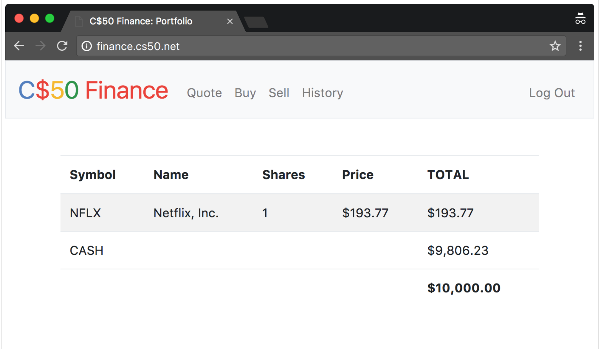

# Similarities



### Вступ

Якщо ви не зовсім розумієте, що означає купляти чи продавати акції компанії, перейдіть за наступним посиланням для того, щоб отримати інструкції: [http://www.investopedia.com/university/stocks/](http://www.investopedia.com/university/stocks/)

Вам потрібно реалізувати C$50 Finance - веб додаток, за допомогою якого можна управляти портфелями акцій. Цей інструмент дозволить вам перевіряти реальні актуальні ціни акцій і значення інвестиційного портфелю, а також купувати і продавати (ок, “купувати і продавати”) акції шляхом запитів до IEX щодо цін акцій. 

Дійсно, IEX дозволяє вам завантажувати біржові котирування за допомогою таких URL як [https://api.iextrading.com/1.0/stock/NFLX/quote](https://api.iextrading.com/1.0/stock/NFLX/quote). Зверніть увагу, як ідентифікатор Netflix (NFLX) вбудовано у цю URL; саме так IEX розпізнає, які дані треба повернути.

Давайте тепер звернемо увагу на набір файлів для лабораторної роботи!


### Набір файлів для лабораторної роботи

#### Завантаження

```bash
$ wget http://cdn.cs50.net/2018/x/psets/7/finance/finance.zip
$ unzip finance.zip
$ rm finance.zip
$ cd finance
$ ls
application.py  helpers.py        static/
finance.db      requirements.txt  templates/
```

#### Запуск

Запустіть вбудований веб сервер Flask за допомогою наступної команди (із папки `finance/`)

```
flask run
```

Відкрийте URL адресу, яку вивів `flask` для того, щоб побачити код із набору файлів для лабораторної роботи у дії. На даний момент ви не зможете увійти у систему чи зареєструватись, але це не надовго!

У переглядачі файлів CS50 двічі клікніть на файлі **finance.db** для того, щоб відкрити його у phpLiteAdmin. Зверніть увагу, що у `finance.db` є таблиця `users`. Подивіться на її структуру (схему). Зверніть увагу, що за замовчуванням нові користувачі отримуватимуть $10000 готівкою. Але у тиблиці (поки що!) немає користувачів (тобто рядків), на які можна подивитись.

Звідси і надалі, якщо ви надаєте перевагу командному рядку, ви можете використовувати `sqlite3` замість phpLiteAdmin.


#### Розуміння

#### `application.py`

Відкрийте файл `application.py`. Згори файла знаходяться декілька підключень бібліотек, серед яких є SQL модуль CS50 і декілька допоміжних функцій. Більше про них ми поговоримо пізніше.

Зверніть увагу, як, після конфігурації [Flask](http://flask.pocoo.org/), цей файл вимикає кешування відповідей (при умові, що ви знаходетесь у режимі відладки, який ввімкнено за замовчуванням у CS50 IDE). Це зроблено для того, щоб ваш браузер "помічав", коли ви змінюєте якісь файли. Далі зверніть увагу, як у файлі конфігурується [Jinja](http://jinja.pocoo.org/) із використанням спеціального "фільтру" `usd` - функції, визначеної у `helpers.py`, що допоможе легше форматувати значення як долари США (USD). Далі у файлі відбувається подальша конфігурація Flask, що дозволяє йому зберігати [сесії](http://flask.pocoo.org/docs/0.12/quickstart/#sessions) у локальній файловій системі (на диску), а не всередині cookies із цифровим підписом (так Flask робить за замовчуванням). Далі у файлі ми говоримо SQL модулю CS50 використовувати `finance.db`, SQLite базу даних, вміст якої ви скоро побачите!

Після всього цього знаходяться декілька маршрутів, причому тільки 2 з них повністю реалізовані: `login` і `logout`. Спочатку прочитайте реалізацію `login`. Зверніть увагу, як вона використовує `db.execute` (із бібліотеки CS50) щоб робити запити до `finance.db`. Також зверніть увагу, як вона використовує `check_password_hash` для того, щоб порівняти хеші паролів користувачів. Нарешті, зверніть увагу як `login` "запам'ятовує", що користувач увійшов у систему шляхом збереження його чи її `user_id` - цілого числа - у сесії. Таким чином кожен з цих маршрутів може перевірити, який користувач (якщо він існує) увійшов до системи. В той же час, `logout` просто очищає сесію, "випускаючи" користувача із системи.

Зверніть увагу, що більшість маршрутів "прикрашені" (decorated) за допомогою `@login_required` (функції, що також визначена у `helpers.py`). Ця "прикраса" (декоратор) забезпечує, що якщо кориситувач намагається відвідати будь-який з цих маршрутів, він спочатку буде переадресований для входу у систему.

Також зверніть увагу, що більгість маршрутів підтримують GET і POST. Але більшість з них (на даний момент!) просто повертають "вибачення" (apology), так як вони ще не реалізовані.


#### `helpers.py`

Далі подивіться на файл `helpers.py`. Ах, ось де знаходиться реалізація `apology`. Зверніть увагу, як вона, в кінці кінців показує шаблон, `apology.html`. Вона також визначає в середині себе ще одну функцію, `escape`, яка просто використовується для того, щоб замініти спеціальні символи у "вибаченнях". Так як ми визначили `escape` всередині `apology`, ми обмежили зону видимості `escape`; ніякі інші функції, окрім `apology`, не зможуть викликати її.

Далі у файлі знаходиться `login_required`. Не хвилюйтесь, якщо ця функція виглядає складною, але якщо вам колись було цікаво, як функція може повертати іншу функцію - ось вам і приклад!

Далі у файлі знаходиться `lookup` - функція, яка, при умові, що їй надали `symbol` (наприклад, NFLX), повертає котирування акції у формі словника із трьому ключами: `name`, значення якого має тип `str` - назва компанії; `price`, значення якого має тип `float` - ціна акції; і `symbol`, значення якого має тип `str` - стандартизована версія символу акції (тобто у верхньому регістрі, наприклад, NFLX), незалежно від того, чи symbol був у верхньому регістрі, коли передавався у `lookup`. 

В кінці файла знаходиться коротка функція `usd`, яка просто форматує `float` як USD (тобто `1234.56` форматується як `$1,234.56`).


#### `static/`

Далі подивіться на папку `static/`, всередині якої знаходиться `styles.css`. Саме тут знаходяться деякий початковий CSS. Вам дозволяється змінювати його як ви вважаєте за потрібне.


#### `templates`

Далі подивіться на папку `templates/`. У файлі `login.html` знаходиться, по суті, HTML форма, стилізована за допомогою [Bootstrap](http://getbootstrap.com/). В той же час, у `apology.html` знаходиться шаблон для вибачення. Пригадайте, що `apology` у `helpers.py` приймало два аргументи: `message`, що передавався до `render_template` як "нижнє" значення, і, опціонально, `code`, що передавався до `render_template` як "верхнє" значення. Зверніть увагу на те, як у `apology.html` ці значення в кінці кінців використовуються! І [ось чому](https://github.com/jacebrowning/memegen). 0:-)

Останній файл, на який нам потрібно подивитись - `layout.html`. Він є більшим, ніж зазвичай, але це в осному через те, що він використовує красиву панель навігації, дружню до мобільних пристроїв, що також базується на Bootstrap. Зверніть увагу на блок `main`, в середину якого мають йти шаблони (включаючи `apology.html` і `login.html`). Цей файл також включає в себе підтримку message flashing від Flask, що дозволяє передавати повідомлення від одного маршрута до іншого для відображення користувачеві.

### Специфікація

#### `register`

Завершіть реалізацію `register` таким чином, щоб він дозволяв користувачеві створювати обліковий запис.

* Вимагайте, щоб користувач ввів ім'я користувача (username), реалізувавши текстове поле із ім'ям `username`. Відображайте вибачення, якщо ввід користувача є пустим чи таке ім'я користувача вже існує.

* Вимагайте, щоб користувач ввів пароль, реалізувавши текстове поле із ім'ям `password`, а потім ввів цей же пароль ще раз, реалізувавши текстове поле із ім'ям `confirmation`. Відображайте вибачення, якщо ввід користувача є пустим чи паролі не співпадають.

* Відправляйте ввід користувача за допомогою POST запиту на адресу `/register`.

* Додайте нового користувача у таблицю `users` (за допомогою `INSERT`), зберігаючи при цьому хеш паролю користувача, а не сам пароль. Хешуйте пароль користувача за допомогою функції [`generate_password_hash`](http://werkzeug.pocoo.org/docs/0.12/utils/#werkzeug.security.generate_password_hash).

* Скоріше за все, ви захочете створити новий шаблон (наприклад, `register.html`), який буде достатньо схожим на `login.html`.

Як тільки ви реалізували реєстрацію коректно, ви матимете змогу зареєструвати обліковий запис і увійти до системи (так як `login` і `logout` вже працюють!). Ви також зможете побачити відповідні рядки у таблиці через phpLiteAdmin чи `sqlite3`.

#### `quote`

Завершіть реалізацію `quote` таким чином, щоб він дозволяв користувачеві дізнаватись поточну ціну акції.

* Вимагайте, щоб користувач ввів символ акції (symbol), реалізувавши текстове поле із ім'ям `symbol`.

* Відправляйте ввід користувача за допомогою POST запиту на адресу `/quote`.

* Скоріше за все, ви захочете створити два нові шаблони (наприклад, `quote.html` і `quoted.html`). Коли користувач відвідує `/quote` через GET запит, відображайте один з цих шаблонів, в середині якого має бути HTML форма, що посилає POST до `/quote`. У відповідь на POST запит, `quote` повинна показувати другий шаблон, в який буде вбудовано одне чи більше значень цін, що були отримані.

#### `buy`

Завершіть реалізацію `buy` таким чином, щоб він дозволяв користувачеві купляти акції

* Вимагайте, щоб користувач ввів символ акції (symbol), реалізувавши текстове поле із ім'ям `symbol`. Відображайте вибачення, якщо ввід користувача є пустим чи такого символу не існує (відповідно до значення, що повернув пошук).

* Вимагайте, щоб користувач ввів кількість акцій, реалізувавши текстове поле із ім'ям `shares`. Відображайте вибачення, якщо ввід користувача не є додатнім цілим числом.

* Відправляйте ввід користувача за допомогою POST запиту на адресу `/buy`.

* Скоріше за все, ви захочете викликати `lookup`, щоб дізнатись поточну ціну акції.

* Скоріше за все, ви захочете використати `SELECT`, щоб дізнатись, скільки грошей є у користувача.

* Додайте одну чи більше таблиць до `finance.db`, що дозволять слідкувати за покупками користувачів. Зберігайте достатньо інформації, щоб знати хто купив які акції, за якою ціною і коли.

    * Використовуйте підходящі типи SQLite.
    * Визначте `UNIQUE` індекси на всіх полях, що мають бути унікальними.
    * Визначте не унікальні індекси на всіх полях, за допомогою яких ви будете виконувати пошук (через `SELECT` із `WHERE`).

* Відображайте вибачення, не проводячи покупку, якщо користувачу не вистачає грошей, щоб придбати задану кількість акцій при поточній ціні.

* Вам не варто хвилюватись про race conditions чи використання транзакцій.

Як тільки ви реалізуєте покупку коректно, ви зможете дивитись покупки користувача у вашій новій (нових) таблиці (таблицях) через phpLiteAdmin чи sqlite3. 

#### `index`

Завершіть реалізацію `index` таким чином, щоб він відображав HTML таблицю, що показує для користувача, що зараз увійшов до системи, якими акціями цей користувач володіє, скількома акціями він володіє, поточну ціну кожної акції і сумарну вартість кожного вкладу (тобто кількість акцій помножена на їх ціну). Також відобразіть поточний грошовий баланс користувача і його загальний статок (тобто сумарну вартість акцій, додану до грошового балансу). 

* Скоріше за все, вам захочеться виконати декілька `SELECT`-ів. В залежності від того, як ви реалізували вашу таблицю (таблиці), вам можуть знадобитись `GROUP BY`, `HAVING`, `SUM` і/або `WHERE`.

* Скоріше за все, вам захочеться викликати `lookup` для кожної акції.

#### `sell`

Завершіть реалізацію `sell` таким чином, щоб він дозволяв користувачеві продавати акції (якими він чи вона володіє).

* Вимагайте, щоб користувач ввів символ акції (symbol), реалізувавши меню вибору із ім'ям `symbol`. Відображайте вибачення, якщо користувач не обрав символ акції користувача є пустим чи (якимось чином, на час відправки) користувач не володіє такими акціями.

* Вимагайте, щоб користувач ввів кількість акцій, реалізувавши текстове поле із ім'ям `shares`. Відображайте вибачення, якщо ввід користувача не є додатнім цілим числом чи якщо користувач не володіє таким числом цих акцій.

* Відправляйте ввід користувача за допомогою POST запиту на адресу `/sell`.

* Вам не варто хвилюватись про race conditions чи використання транзакцій.

#### `history`

Завершіть реалізацію `history` таким чином, щоб він відображав HTML таблицю, що показує для користувача всі його транзакції, показуючи рядок за рядком всі його покупки та продажі.

* Для кожного рядка вкажіть, акція була продана чи куплена, а також вкажіть її символ, ціну покупки чи продажу, кількість куплених чи проданих акцій, а також дату і час, коли транзакцію було проведено.

* Вам, можливо, необхідно буде змінити таблицю, що ви створювали для покупок чи доповнити її додатковою таблицею. Намагайтесь мінімізувати надлишковість.

#### Власне доповнення

Реалізуйте хоча б одне власне доповнення за вашим вибором:

* Дозвольте користувачам змінювати їх пароль.

* Дозвольте користувачам вносити гроші на їх рахунок.

* Дозвольте користувачам купляти чи продавати акції напряму через `index`, без потреби вводити символ акції вручну.

* Вимагайте від паролю користувача містити якусь кількість букв, цифр і/або інших символів.

* Реалізуйте якийсь інший функціонал аналогічної складності.

### Відеоінструкція

**Замість функції `pwd_context.encrypt`, яку згадує Замайла, використовуйте функцію `generate_password_hash`**

[Посилання на YouTube](https://www.youtube.com/watch?list=PLhQjrBD2T380UP0XpPRhaUNxWbhftko_b&time_continue=1&v=sy1o1yLob5U)

Зверніть увагу, що там знаходиться не одне, а вісім відео!

### Тестування

Обов'язково протестуйте ваш веб додаток вручну, зробивши наступне:

* Введіть алфавітні рядки у поля, які очікують отримати числа
* Введіть нуль чи від'ємне число у поля, де очікуються лише додатні числа.
* Введіть неціле число у поля, де очікуються лише цілі числа.
* Намагайтесь витратити більше грошей, ніж є у користувача.
* Намагайтесь продати більше акцій, ніж є у користувача.
* Введіть некоректний символ акції
* Додайте потенційно неьбезпечні символи, як `'` і `;` у SQL запити.

#### Коректніcть

```bash
check50 cs50/2018/x/finance
```

#### Стиль

```bash
style50 application.py
```

### Розв'язок працівників CS50

Ви можете виконувати ваш додаток у будь-якому стилі, але ось як виглядає розв'язок працівників CS50!

[http://finance.cs50.net/](http://finance.cs50.net/)

Ви можете зареєструвати обліковий запис і погратись із ним. **Не використовуйте** пароль, що ви використовуєте на інших сайтах.

Ми **рекомендуємо** дивитись на HTML і CSS цього розв'язку під час виконання роботи.

### Підказки

* В середині `cs50.SQL` знаходиться метод `execute`, перший аргумент якого - рядок із SQL командою. Якщо цей рядок містить іменовані параметри, з якими мають зв'язуватись значення, ці значення можуть бути передані як додаткові іменовані параметри до `execute`. Подивіться на реалізацію `login` для одного з таких прикладів. Значення, що повертає `execute`, є наступним:
  * Якщо виконується `SELECT`, то `execute` повертає список із нуля чи більше об'єктів `dict`, всередині яких ключі і значення відображають назви і значення полів таблиці, відповідно.
  * Якщо виконується `INSERT`, і таблиця, у яку вставляються дані, має `PRIMARY KEY`, що збільшується автоматично, то `execute` повертає значення первинного ключа щойно вставленого рядка. 
  * Якщо виконується `DELETE` чи `UPDATE`, то `execute` повертає кількість рядків, що було видалено чи змінено.
  * Якщо `INSERT` чи `UPDATE` порушують деякі обмеження (наприклад, індекс `UNIQUE`), то `execute` повертає `None`. У випадку помилок, execute прокидує `RuntimeError`.
* Пригадайте, що cs50.SQ буде логувати у ваше вікно терміналу всі запити, що ви виконуєте за допомогою execute (щоб ви могли переконатись, що це ті запити, які ви хочете робити)
* Використовуйте іменовані параметри, з якими мають зв'язуватись значення, (тобто використовуйте `named` [`paramstyle`](https://www.python.org/dev/peps/pep-0249/#paramstyle)) під час викликів `execute`, за зразком `WHERE name=:name`. **Не використовуйте** `f-рядки`, [`format`](https://docs.python.org/3.1/library/functions.html#format), чи `+` (тобто конкантенацію), адже це призводить до риску атаки через SQL ін'єкцію.
* Якщо (і тільки в цьому випадку!) ви добре знайомі із SQL, ви можете використовувати [SQLAlchemy Core](https://docs.sqlalchemy.org/en/latest/index.html) чи [Flask-SQLAlchemy](http://flask-sqlalchemy.pocoo.org/2.3/) (тобто [SQLAlchemy ORM](https://docs.sqlalchemy.org/en/latest/index.html)) замість `cs50.SQL`.
* Вам дозволяється додавати статичні файли до `static/`.
* Скоріше за все вам захочеться проконсультуватись із [документацією Jinja](http://jinja.pocoo.org/docs/dev/) під час реалізації ваших шаблонів.
* Ми **рекомендуємо** вам попросити інших використати ваш вебсайт (і намагатись знайти в ньому помилки). За допомогою **Share** у верхньому правому куті ви можете поділитись вашим додатком (**Application**), зробивши його публічним (**Public**). Переконайтесь, що ви не ділетесь своїм редактором (**Editor**), що надасть доступ до вашого коду на Python і базі даних SQLite.
* Вам дозволяється змінювати зовнішній вигляд сайтів, як наприклад, за посиланнями:
[https://bootswatch.com/4-alpha/](https://bootswatch.com/4-alpha/),
[https://getbootstrap.com/docs/4.0/content/](https://getbootstrap.com/docs/4.0/content/),
[https://getbootstrap.com/docs/4.0/components/](https://getbootstrap.com/docs/4.0/components/), і/або
[https://memegen.link/api/templates](https://memegen.link/api/templates).

### Запитання, що часто виникають

#### ImportError: No module named 'application'

За замовчуванням, `flask` шукає файл із назвою `application.py` у вашій поточній папці (тому що ми так сконфігурували значення змінної середовища `FLASK_APP`,  щоб воно було рівне `application.py`). Якщо ви бачите цю помилку, скоріше за все ви виконали `flask` із неправильної папки!

#### OSError: [Errno 98] Address already in use

Якщо після виконання `flask` ви бачите цю помилку, скоріше за все у вас виконується `flask` у іншій вкладці. Переконайтесь, що ви вбили цей інший процес за допомогою ctrl-c перед тим, як знову стартувати `flask`. Якщо у вас немає такої вкладки, виконайте `fuser -k 8080/tcp` щоб вбити всі процеси, які все ще слухають TCP порт 8080.

#### check50 ran into an error while running checks!

Якщо під час виконання `check50` ви бачите цю помилку, скоріше за все у вашому коді десь є баг! Відкрийте посилання CS50.me, яке згенерував `check50`, щоб побачити детальний звіт для того, щоб легше знайти помилку!

