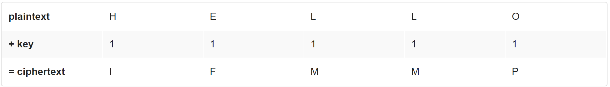

# Caesar

### Вступ

Вважається, що Цезар (так, той самий Цезар) зашифровував усі конфіденційні повідомлення (тобто змінював їх таким чином, щоб можна було відновити оригінал) шляхом зсуву кожної букви на декілька кроків. Наприклад, він міг написати A як B, B як C, C як D ... Z як A (ніби заокруглюючи алфавіт). А отже, щоб сказати комусь HELLO, Цезар міг написати IFMMP. Після отримання такого повідомлення від Цезаря, отримувачі повинні були розшифрувати це повідомлення шляхом зсуву букв у зворотньому напрямку на таку саму кількість кроків.

Секретність такої "криптосистеми" полягала у тому, що тільки Цезар і отримувач повідомлення знали секретну інформацію - кількість кроків на яку Цезар зсунув букви (наприклад, 1). Таке спілкування не є надто безпечними за стандартами сьогодення, але якщо ви перша людина у світі яка займається подібними речами, це є доволі безпечним!

Незашифрований текст зазвичай називають plaintext. Зашифрований текст зазвичай називають ciphertext. Секретна інформація, що використовується при шифруванні, називається ключем.

На рисунку нижче зображено, як слово HELLO із використанням ключа 1 шифрується у IFMMP.



Більш загально, алгоритм Цезаря (тобто шифр Цезаря) шифрує повідомлення шляхом "обертання" кожної букви на *k* позицій. Формальніше, якщо *p* - якийсь plaintext (незашифрованне повідомлення), *p<sub>i</sub>* - це *i-ий* символ у *p*, а *k* - секретний ключ (тобто невід'ємне ціле число), тоді кожна буква *c<sub>i</sub>* у зашифрованному тексті *c*, обраховується наступним чином:

<p style="text-align: center;"> c<sub>i</sub>=(p<sub>i</sub>+k) mod 26 </p>

де mod 26 означає "остача від ділення на 26". Ця формула, мабуть, робить так, що шифр видається більш складним, ніж він є насправді, але це всього лиш є лаконічною формою точного вираження суті алгориму.

### Специфікація

Розробіть програму `caesar`, яка зашифровує повідомлення за допомогою шифру Цезаря.

* Розробіть вашу програму у файлі `caesar.c`, розмістивши його у папці `caesar`.

* Ваша програма має приймати один аргумент із командного рядка - невід'ємне ціле число. В подальшому називатимемо його *k*.

* Якщо вашу програму виконують без аргументів командного рядка або більше ніж з одним аргументом, ваша програма має вивести повідомлення про помилку (за допомогою `printf`; його текст може бути довільним) і одразу ж повернути значення `1` із функції `main` (це зазвичай означає помилку). 

* Ви можете вважати, що якщо користувач надає рівно 1 аргумент командного рядка, він буде невід'ємним цілим числом (наприклад, 1). Не варто перевіряти, чи це дійсно є так.

* Не вважайте, що *k* буде меншим або рівним за 26. Ваша програма має працювати з усіма невід'ємними цілими значеннями *k*, що менші за 2<sup>31</sup> - 26. Іншими словами, вам не потрібно хвилюватись, що ваша програма зламається, якщо користувач введе значення *k*, що є занадто великим (або майже занадто великим) для того, щоб вміститись у тип даних `int` (згадайте, що `int` може переповнюватись.) Але навіть у випадку коли *k* більше за 26, алфавітні символи з вхідних даних вашої програми мають залишатись алфавітними символами у вихідних даних вашої програми. Наприклад, якщо `k = 27`, `A` не має ставати `[`, не дивлячись на те, що символ `[` розташований на відстані 27 кроків від `A` у таблиці ASCII; `A` має стати `B`, так як `B` розташоване на відстані 27 символів від `А` з урахуванням того, що між `Z` та `A` відбувається заокруглення алфавіту.

* Ваша програма має вивести на екран текст `plaintext:` (без символу нового рядка), попросивши користувача ввести незашифроване повідомлення (використовуючи `get_string`).

* Ваша програма має вивести на екран текст `ciphertext:` (без символу нового рядка), а після цього вивести зашифровану версію тексту, що надав користувач. Кожен алфавітний символ має бути "повернутим" на *k* позицій; не алфавітні символи повинні не змінюватись.

* Ваша програма має зберігати регістр букв: великі літери після обертання мають залишитись великими, а малі - малими.

* Після виведення зашифрованного тексту, ви повинні вивести символ нового рядка. Після цього ваша програмає має завершитись, повернувши `0` із `main`.

### Відеоінструкція

[Посилання на YouTube](https://www.youtube.com/watch?v=ergRKv3DglI)

### Використання вашої програми

Ваша програма повинна поводитись, як вказано у прикладах.

```bash
$ ./caesar 1
plaintext:  HELLO
ciphertext: IFMMP
```

```bash
$ ./caesar 13
plaintext:  hello, world
ciphertext: uryyb, jbeyq
```

```bash
$ ./caesar 13
plaintext:  be sure to drink your Ovaltine
ciphertext: or fher gb qevax lbhe Binygvar
```

```bash
$ ./caesar
Usage: ./caesar k
```

```bash
$ ./caesar 1 2 3 4 5
Usage: ./caesar k
```

### Тестування

#### Коректність

```bash
check50 cs50/2018/x/caesar
```

#### Стиль

```bash
style50 caesar.c
```

### Розв'язок працівників CS50

```bash
~cs50/pset2/caesar
```

### Підказки

Ця програма повинна приймати аргумент командного рядка, *k*, тому вам потрібно оголосити `main` наступним чином:

```C
int main(int argc, string argv[])
```

Згадайте, що `argv` це "масив" рядків. Ви можете думати про масив як про ряд шафок у роздягальні спортивного залу, в середині кожної з яких знаходиться якесь значення (і, можливо, чиїсь шкарпетки). У нашому випадку, в середині кожної такої шафи знаходиться рядок. Для того щоб відкрити (звернутись за індексом) першу шафу, використовуйте синтаксис `argv[0]`, так як масиви індексуються з 0. Для того, щоб відкрити наступну шафу, використовуйте `argv[1]` і т.д. Звичайно, якщо існує `n` шаф, вам краще зупинитись із відкриванням після `argv[n - 1]`, так як `argv[n]` не існує! (Або ця шафа належить комусь іншому, і в цьому випадку вам також не слід її відкривати.)

А отже, ви можете отримати доступ до *k* наступним кодом (якщо припустити, що користувач його дійсно ввів)

```C
string k = argv[1];
```
Згадайте, що `argc` - це змінна типу `int`, яка дорівнює кількості рядків, що знаходяться у `argv`, тому краще перевірити значення `argc` до того, як відкривати шафу, що не існує! В ідеальному випадку для нашої програми, `argc` дорівнюватиме `2`. Чому? Пригадайте, що всередині `argv[0]` за замовчуванням зберігається назва програми. Отже, `argc` завжди буде щонайменше `1`. Але для цієї програми ви хочете, щоб користувач надав аргумент командного рядка, *k*, а отже `argc` має дорівнювати `2`. Звичайно, якщо користувач надасть більше ніж один аргумент командного рядка, `argc` буде більше ніж `2`, і у цьому випадку, знову ж таки, ваша програма має вивести помилку і повернути `1`.

Лише те, що користувач вводить ціле число у командному рядку, не означає, що ці вхідні дані будуть автоматично збережені у типі даних `int`. Навпаки, вони будуть збережені як рядок, який всього лиш виглядає як ціле число! А отже, вам необхідно сконвертувати цей рядок у тип даних `int`. На щастя, існує функція `atoi`, яка створена саме для цього. Ось як ви можете її використати:

```C
int k = atoi(argv[1]);
```


Зверніть уваги, що цього разу ми визначили *k* як змінну типу `int`, а отже ви можете виконувати із нею арифметичні операції.

Так як `atoi` оголошена у `stdlib.h`, вам необхідно підключити (`#include`) цей файл заголовків у верхній частині вашого коду. (З технічної точки зору, ваш код скомпілюється і без неї, так як вона вже включена до `cs50.h`. Але краще не довіряти іншим бібліотекам підключення файлів заголовків, що потрібні вам.)

Як тільки ви зберегли *k* у змінній типу *int*, вам потрібно попросити користувача ввести незашифрованний текст. Функція `get_string` від CS50 може допомогти вам із цим.

Як тільки у вас є *k* і незашифрований текст, настає час зашифрувати текст за допомогою ключа. Згадайте, що ви можете ітеруватись по символам рядка, друкуючи кожен із них, за допомогою такого коду:

```C
for (int i = 0, n = strlen(p); i < n; i++)
{
    printf("%c", p[i]);
}
```

Іншими словами, точно так само, як `argv` є масивом рядків, рядок є масивом символів. А отже, ви можете використовувати квадратні дужки для того, щоб отримати доступ до окремих символів у рядку, так само, як ви отримували доступ до окремих рядків у `argv`. Круто, чи не так? Звичайно, друк кожного із символів у рядку не є криптографією. Хіба що у випадку, коли *k* дорівнює `0`. Але вищенаведенний код має допомогти вам допомогти Цезарю реалізувати його шифр!

До речі, вам доведеться підключити ще один файл заголовків для того, щоб використовувати `strlen`.

Окрім `atoi`, ви можете знайти деякі інші зручні функції, задокументовані за посиланням [reference.cs50.net](https://reference.cs50.net/) у розділах `ctype.h` та `stdlib.h`. Наприклад, під час ітерування по символам незашифрованного тексту, вам може знадобитись функція `isalpha`.

Щодо заокруглення від `Z` до `A` (чи від `z` до `a`), не забудьте про оператор `%`, за допомогою якого у C знаходять остачу від ділення. Також вам можливо знадобиться [http://asciichart.com/](http://asciichart.com/). Цей ресурс показує ASCII коди не тільки для алфавітних символів, що може знадобитись вам у випадку, коли ви ненароком виводите непотрібні символи.


