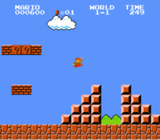

# Mario hard

### Вступ

На початку рівня World 1-1 гри Super Mario Brothers компанії Nintendo, Маріо повинен перестрибнути через дві напів-піраміди блоків на його
шляху до флагштоку. Знизу наведено скріншот.



### Специфікація

* Напишіть прогаму, яка відтворює ці напів-піраміди використовуючи символи `#` замість блоків. Назвіть ваш файл `mario.c` і розмістіть його у папці
`~/workspace/pset1/mario/more/`

* Для того, щоб зробити завдання більш цікавим, спочатку запитайте у користувача, якою має бути висота піраміди. Це число має бути невід'ємним
і не більшим ніж 23. (Висота напів-пірамід зображених на рисунку, дорівнює 4, їхня ширина також дорівнює 4, а розмір проміжку між ними дорівню 2)

* Якщо користувач не вводить невід'ємне число, не більше ніж 23, ви маєте попросити його ввести висоту ще раз

* Далі, за допомогою `printf` та одного чи більше циклів, згенеруйте бажані напів-піраміди.

* Переконайтесь, що нижній лівий кут вашої лівої напів-піраміди розташований з лівого краю вікна вашої консолі.

### Відеоінструкція

[Посилання на YouTube](https://www.youtube.com/watch?v=xX7DQGkEG48)

### Використання вашої програми

Ваша програма повинна поводитись, як вказано у прикладах.

``` bash
$ ./mario
Height: 4
   #  #
  ##  ##
 ###  ###
####  ####
```

``` bash
$ ./mario
Height: 0
```

``` bash
$ ./mario
Height: -5
Height: 4
   #  #
  ##  ##
 ###  ###
####  ####
```

``` bash
$ ./mario
Height: -5
Height: five
Height: 40
Height: 24
Height: 4
   #  #
  ##  ##
 ###  ###
####  ####
```

### Тестування

#### Коректність

``` bash
check50 cs50/2018/x/mario/more
```

#### Стиль

``` bash
style50 mario.c
```

### Розв'язок працівників CS50

``` bash
~cs50/hacker1/mario
```

### Підказки

Постарайтесь знайти зв'язок між (a) висотою, яку вводить користувач, (b) який рядок піраміди зараз виводиться і (c) 
скільки пробільних символів та символів `#` є у цьому рядку. Як тільки ви знайдете формулу, ви зможете перевести її на мову
С!
