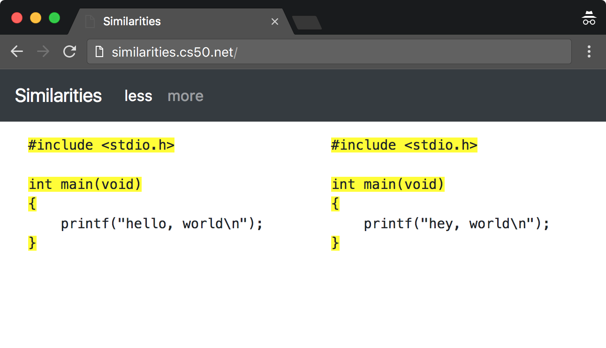

# Similarities



### Вступ

Визначення того, чи два файли є ідентичними - (відносно!) тривіальна задача: ми можемо ітеруватись по символам у кожному із файлів і порівнювати їх між собою. Але визначення того, чи два файли є схожими не є тривіальною задачею. В кінці кінців, що значить "бути схожим"? Можливо те, що файли мають спільні рядки. Можливо те, що файли мають спільні речення. Можливо те, що файли мають спільні підрядки.

Думаю, ви вже зрозуміли, що ваша задача - визначити, чи два файли є схожими!

### Набір файлів для лабораторної роботи

#### Завантаження

```bash
$ wget http://cdn.cs50.net/2017/fall/psets/6/similarities/less/similarities.zip
$ unzip similarities.zip
$ rm similarities.zip
$ cd similarities
$ chmod a+x compare
$ ls
application.py  compare* helpers.py  requirements.txt  static/  templates/
```

#### Розуміння

#### compare

Відкрийте файл `compare`. Легко бачити, що ім'я файлу не закінчується на `.py`, хоча файл містить програму, написану на Python. Але це нормально! Зверніть увану на "шебанг" згори файлу:

```
#!/usr/bin/env python3
```

Цей рядок говорить комп'ютеру інтерпретувати (тобто виконувати) цю програму із використанням `python3` (він же - `python` у CS50 IDE), інтерпретатора, що розуміє Python 3.

Зверніть увагу, як цей файл визначає функцію `main` і викликає її ближче до нижньої частини файлу. Визначати `main` не є обов'язковим у Python, але визначення функції до того часу, коли ви будете її використовувати, є обов'язковим. Відповідно, так як `main` викликає функцію із назвою `positive`, і тому, що ми хотіли тримати головну частину цієї програми у верхній частині файлу, був сенс реалізувати `main` як функцію. Таким чином, `main` вперше викликається у нижній частині файлу (після того, як було визначено `positive`), не дивлячись на те, що `main` реалізовано у верхній частині файлу.

Немає потреби розуміти кожен рядок коду у `compare`, але зверніть увагу, відповідно до коментарів, що в загальному робить цей код: він "розбирає" надані аргументи командного рядка, вичитує два файли у змінні як рядки, порівнює ці два рядки і потім виводить список схожостей. Рядки порівнюються між собою одним із трьох способів, що визначається аргументом командного рядка: рядок до рядка, речення до речення чи підрядок до підрядка. 


#### helpers.py

Відкрийте файл `helpers.py`. Ох, знайоме нам `TODO`. У цьому файлі визначено три функції, кожна з яких повинна реалізовувати різний алгоритм порівняння: для рядків, речень і підрядків. На даний момент, кожна з них повертає порожній список. Але це не надовго!


#### application.py

Відкрийте файл `application.py`. Цей файл реалізує веб-додаток, який, в кінці кінців, довзолить вам виконувати будь-який із цих трьох алгоритмів на будь-яких двох текстових файлах. Немає потреби повністю розуміти цей файл, особливо `highlight` і `errorhandler`. Але знайте, що `highlight`, при умові, що йому надали рядок `s` та список інших рядків `strings`, підсвічує (шляхом обернення їх у HTML тег `span`) всі входження даного рядка у список. `errorhandler` забезпечує те, що будь-які HTTP помилки будуть зображені на власній сторінці.

Обов'язково прочитайте функції `index` і `compare`, остання з яких працює з відправленням через форми.


#### templates/index.html

Відкрийте файл `templates/index.html`. Ох, останнє `TODO`. Зверніть увагу, як цей шаблон "розширює" (extends) `layout.html`, що говорить нам про те, що `layout.html` є основою, з якої буде зроблено `index.html`. Блок, визначений у `index.html`, буде вставлено у відповідне місце для блоку у `layout.html`.

В кінці кінців, цей файл міститиме форму, за допомогою якої користувач зможе завантажити два файли до вашого веб-додатка для порівняння одним із ваших трьох алгоритмів.

#### templates/compare.html

Відкрийте файл `templates/compare.html`. Ми реалізували цей файл для вас. Завдяки його використанню CSS (особливо класу із назвою `col-6`), він забезпечує, що файли користувача, як тільки вони будуть завантажені і підсвічені, одразу ж будуть відображені один біля одного.

#### templates/error.html

Відкрийте файл `templates/error.html`. У цьому файлі знаходиться шаблон, за допомогою якого будуть показані усі HTTP помилки. Для цього він використовує компонент Bootstrap під назвою [Jumbotron](https://getbootstrap.com/docs/4.0/components/jumbotron/).

#### static/styles.css

Відкрийте файл `static/styles.css`. У цьому файлі знаходяться деякі CSS властивості, які разом реалізують інтерфейс користувача вашого веб-додатку. Насправді, вони модифікують деякі значення за замовчуванням Bootstrap.

#### requirements.txt

Відкрийте файл `requirements.txt` (не змінюючи його, хоча в майбутньому ви можете це зробити якщо захочете). Цей файл визначає бібліотеки, по одній в рядок, від яких залежить вся ця функціональність.

### Специфікація

#### `helpers.py`

##### `lines`

Реалізуйте функцію `lines` таким чином, що, якщо їй передати два рядки, `a` і `b`, вона повертає список ліній, які присутні і у `a`, і у `b`. У списку не повинно бути дублікатів. Вважайте, що лінії у `a` і `b` будуть розділені символом `\n`, але рядки у списку, що повертається, не повинні закінчуватись на `\n`. Якщо і `a` і `b` містять один або більше пустих рядків (тобто `\n`, перед яким немає ніяких інших символів), список, що буде повернено, повинен включати у себе пустий рядок (тобто `""`).

##### `sentences`

Реалізуйте функцію `sentences` таким чином, що, якщо їй передати два рядки, `a` і `b`, вона повертає список *унікальних* речень на англійській мові, які присутні і у `a`, і у `b`. У списку не повинно бути дублікатів. Використовуйте `sent_tokenize` із Natural Language Toolkit для того, щоб розбити кожен рядок на список речень. Його можна імпортувати таким чином:

```python
from nltk.tokenize import sent_tokenize
```

Відповідно до його [документації](http://www.nltk.org/api/nltk.tokenize.html#nltk.tokenize.sent_tokenize), `sent_tokenize`, при умові, що йому надали `str` у якості вхідних даних, повертає список речень англійської мови, що присутні у цьому рядку. Ця функція вважає, що її вхідні дані насправді є текстом на англійській мові (а не, наприклад, кодом, який випадково також може містити у собі крапки).

##### `substrings`

Реалізуйте функцію `substrings` таким чином, що, якщо їй передати два рядки, `a` і `b` і ціле число `n`, вона повертає список усіх підрядків довжиною `n`, які присутні і у `a`, і у `b`. У списку не повинно бути дублікатів. 

Пригадайте, що підрядком довжини `n` деякого рядка є всього лиш послідновність із `n` символів, що йдуть один за одним. Наприклад, якщо `n` дорівнює `2`, а рядком є `Yale`, існує три можливих підрядка довжини `2`: `Ya`, `al` і `le`. В той же час, якщо `n` дорівнює `1`, а рядком є `Harvard`, існує сім можливих підрядків довжини `1`: `H`, `a`, `r`, `v`, `a`, `r` і `d`. Але після того, як ми видалимо всі дублікати, існує тільки п'ять унікальних підрядків: `H`, `a`, `r`, `v` і `d`.

##### `templates/index.html`

Реалізуйте `templates/index.html` таким чином, щоб у ньому була HTML форма, за допомогою якої користувач може відправляти:

* Файл з назвою `file1`
* Файл з назвою `file2`
* Значення `lines`, `sentences` чи `substrings` для вхідних даних, що називаються `algorithm`
* Число з назвою `length`

Вам дозволяється дивитись на HTML із розв'язку викладачів при потребі, але спочатку спробуйте створити правильний синтаксис самостійно, використовуючи https://www.google.com/search?q=html+forms!


### Відеоінструкція

[Посилання на YouTube](https://www.youtube.com/watch?list=PLhQjrBD2T382DOV8V9pWN7NTp0uRLvIYa&v=JlGPuG6fIXs)

Зверніть увагу, що там знаходиться не одне, а п'ять відео!

### Тестування

Для того, щоб перевірити вашу реалізацію lines, sentences, і/або substrings за допомогою командного рядка, виконайте `compare` наступним чином, де FILE1 і FILE2 - два будь-які текстові файли:

```bash
./compare --lines FILE1 FILE2
./compare --sentences FILE1 FILE2
./compare --substrings 1 FILE1 FILE2
./compare --substrings 2 FILE1 FILE2
...
```

Для того, щоб перевірити вашу реалізацію через веб-додаток, виконайте

```bash
flask run
```

і перейдіть по URL, яке було виведено на екран.

Ви можете знайти деякі тестові приклади за адресою http://cdn.cs50.net/2017/fall/psets/6/similarities/inputs/, але обов'язково перевірте вашу програму за допомогою ваших тестів!

#### Коректніcть

```bash
check50 cs50/2018/x/similarities/less
```

#### Стиль

```bash
style50 helpers.py
```

### Розв'язок працівників CS50

#### Командний рядок

```
~cs50/pset6/less/compare
```

#### WEB

http://similarities.cs50.net/less