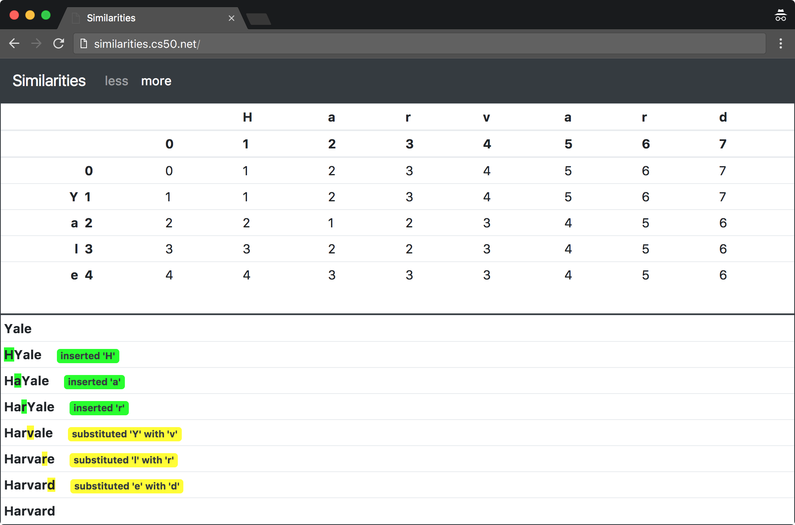

# Similarities



### Вступ

Визначення того, чи є два рядки ідентичними - (відносно!) тривіальна задача: ми можемо ітеруватись по символам у кожному із рядків і порівнювати їх між собою. Але порівняння того, наскільки несхожими між собою є два (не однакових) рядки не є тривіальним. Ця процедура може займати багато часу, так як є декілька (і часто - багато!) способів перетворити один рядок на інший.

Задача, що стоїть перед вами - виміряти "відстань редагування" між двома рядками: мінімальну кількість додавань, видалень і/або замін символів, що необхідно зробити, щоб перетворити один рядок на інший.


### Набір файлів для лабораторної роботи

#### Завантаження

```bash
$ wget http://cdn.cs50.net/2017/fall/psets/6/similarities/more/similarities.zip
$ unzip similarities.zip
$ rm similarities.zip
$ cd similarities
$ chmod a+x score
$ ls
application.py  helpers.py  requirements.txt  score*  static/  templates/
```

#### Розуміння

#### score

Відкрийте файл `score`. Легко бачити, що ім'я файлу не закінчується на `.py`, хоча файл містить програму, написану на Python. Але це нормально! Зверніть увану на "шебанг" згори файлу:

```
#!/usr/bin/env python3
```

Цей рядок говорить комп'ютеру інтерпретувати (тобто виконувати) цю програму із використанням `python3` (він же - `python` у CS50 IDE), інтерпретатора, що розуміє Python 3.

Зверніть увагу, як цей файл визначає функцію `main` і викликає її ближче до нижньої частини файлу. Визначати `main` не є обов'язковим у Python, але таке визначення не є рідкісним.

Зверніть увагу, як `score` використовує модуль Python під назвою `argparse` для того, щоб розібрати ("розпарсити") два аргументи командного рядка, `FILE1` і `FILE2` - файли, які потрібно порівняти. Потім програма намагається зчитати вміст цих файлів у рядки, `file1` і `file2`. Якщо щось іде не так, про що говорить `IOError`, ловиться "виключення" (exception). Для того, щоб отримати більше інформації про виключення, перейдіть за посиланням: https://docs.python.org/3/tutorial/errors.html

В кінці кінців, програма передає ці два рядки функції `distances`, яку ми побачимо невдовзі, і друкує відстань редагування між цими двома файлами!


#### helpers.py

Відкрийте файл `helpers.py`. Ох, знайоме нам `TODO`. У цьому файлі визначено функцію із назвою `distances`, яка приймає два рядки, `a` і `b`, і повинна повернути (за допомогою матриці вартостей) відстань редагування між цими рядками. Але на даний момент вона просто повертає порожній двовимірний список!

Цей файл також визначає "перерахування" ("enumeration", "Enum"), яке визначає три константи, кожна з яких представляє собою операцію, за допомогою якої рядок може бути перетворено на інший:  `Operation.DELETED` (видалення символа), `Operation.INSERTED` (додавання символа) і `Operation.SUBSTITUTED` (заміна символа).


#### application.py

Відкрийте файл `application.py`. Цей файл реалізує веб-додаток, який, в кінці кінців, довзолить візуалізувати відстань редагування між двома рядками, а також операції, необхідні для того, щоб перетворити один рядок на інший за мінімальну ціну. Вам не обов'язково розуміти весь цей файли, але зверніть увагу, як `score` визначає із матриці, яку повертає `distances`, послідовність операцій, які призводять до цієї мінімальної вартості.

#### templates/layout.html

Відкрийте файл `templates/layout.html`. У цьому файлі розміщено шаблон для загального макету веб-додатку. Скоріше за все ви і впізнаєте деякі HTML теги у цьому файлі, і побачите деякі нові. Особливо зверніть увагу, як наш шаблон використовує Bootstrap - популярну бібліотеку. Насправді, цей щаблон розроблено на основі [стартового шаблону Bootstrap](http://getbootstrap.com/docs/4.0/getting-started/introduction/) 

#### templates/index.html

Відкрийте файл `templates/index.html`. Ох, ще одне `TODO`. Зверніть увагу, як цей шаблон "розширює" (extends) `layout.html`, що говорить нам про те, що `layout.html` є основою, з якої буде зроблено `index.html`. Блок, визначений у `index.html`, буде вставлено у відповідне місце для блоку у `layout.html`.

В кінці кінців, цей файл міститиме форму, за допомогою якої користувач зможе відправляти два рядки до вашого веб-додатка для порівняння.

#### templates/score.html

Відкрийте файл `templates/score.html`. Ми реалізували цей файл для вас. Завдяки його використанню CSS (особливо класу із назвою `row`), він забезпечує, що `matrix.html` заповнить верхню половину вікна браузера і що `log.html` заповнить його нижню частину.

#### templates/matrix.html

Відкрийте файл `templates/matrix.html`. Ох, ще одне `TODO`. Саме за допомогою цього файлу вам потрібно буде згенерувати HTML таблицю, що зображує ціни під час процесу перетворення одного рядка на інший.

#### templates/log.html

Відкрийте файл `templates/log.html`. Хух, здається цей файл вже реалізований за вас. Дійсно, саме за допомогою цього файлу ваш веб-додаток згенерує HTML таблицю, що підсумовує операції під час процесу перетворення одного рядка на інший.

#### templates/error.html

Відкрийте файл `templates/error.html`. У цьому файлі знаходиться шаблон, за допомогою якого будуть показані усі HTTP помилки. Для цього він використовує компонент Bootstrap під назвою [Jumbotron](https://getbootstrap.com/docs/4.0/components/jumbotron/).

#### static/styles.css

Відкрийте файл `static/styles.css`. У цьому файлі знаходяться деякі CSS властивості, які разом реалізують інтерфейс користувача вашого веб-додатку. Насправді, вони модифікують деякі значення за замовчуванням Bootstrap.

#### requirements.txt

Відкрийте файл `requirements.txt` (не змінюючи його, хоча в майбутньому ви можете це зробити якщо захочете). Цей файл визначає бібліотеки, по одній в рядок, від яких залежить вся ця функціональність.

### Специфікація

#### `helpers.py`

##### `distances`

Реалізуйте функцію `distances` таким чином, що, якщо їй передати два рядки, `a` і `b`, вона обраховує відстань редагування між `a` і `b`, повертаючи (як список списків) матрицю витрат що трапились в процесі перетворення. Вважайте, що верхній лівий кут матриці має координати `[0][0]`, а правий нижній кут - `[len(a)][len(b)]`. У кожному елементі матриці повинен зберігатись `tuple` `(cost, operation)`, де `cost` має тип даних `int`, а `operation` має тип даних `Operation`.

##### `templates/index.html`

Реалізуйте `templates/index.html` таким чином, щоб у ньому була HTML форма, за допомогою якої користувач може відправляти:

* Рядок з назвою `string1`
* Рядок з назвою `string2`

Вам дозволяється дивитись на HTML із розв'язку викладачів при потребі, але спочатку спробуйте створити правильний синтаксис самостійно, використовуючи https://www.google.com/search?q=html+forms!

##### `templates/matrix.html`

Реалізуйте `templates/matrix.html` таким чиномЮ що він генерує, використовуючи [Jinja2](http://jinja.pocoo.org/), візуалізацію матриці, що повертає `distances` (якщо ій надати деякі рядки `a` і `b`) за допомогою HTML таблиці. У кожній комірці таблиці має бути лише ціна, а не операція. Уздовж найлівішої колонки мають знаходитись символи із `a`, кожен у своїй комірці (і своєму рядку); уздовж найвищого рядка мають знаходитись символи із `b`, кожен у своїй комірці (і своєму стовпцю). 

### Відеоінструкція

[Посилання на YouTube](https://www.youtube.com/watch?list=PLhQjrBD2T381-bOArPXzvlXpovpdBhrZ3&v=-yC8tN4WJk4)

Зверніть увагу, що там знаходиться не одне, а чотири відео!

### Тестування

Для того, щоб перевірити вашу реалізацію `distances` за допомогою командного рядка, виконайте `score` наступним чином, де `FILE1` і `FILE2` - два будь-які текстові файли:

```bash
./score FILE1 FILE2
```

Для того, щоб перевірити вашу реалізацію через веб-додаток, виконайте

```bash
flask run
```

і перейдіть по URL, яке було виведено на екран.

Ви можете знайти деякі тестові приклади за адресою http://cdn.cs50.net/2017/fall/psets/6/similarities/inputs/, але обов'язково перевірте вашу програму за допомогою ваших тестів!

#### Коректніcть

```bash
check50 cs50/2018/x/similarities/more
```

#### Стиль

```bash
style50 helpers.py
```

### Розв'язок працівників CS50

#### Командний рядок

```
~cs50/pset6/more/score
```

#### WEB

http://similarities.cs50.net/more