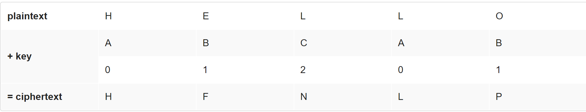

# Vigenère

### Вступ

Шифр Віженера є покращенням відносно до [шифру Цезаря](caesar.md). Шифрування у ньому відбувається шляхом використання послідовності ключів (ключового слова). Тобто, якщо *р* - деякий текст і *k* - ключове слово (як, наприклад, алфавітний рядок, де `А` представляє собою `0`, `B` представляє собою `1`, `C` представляє собою `2`, `Z` представляє собою `25`), то кожна літера *c<sub>i</sub>* в зашифрованому тексті *c* обраховується як

<p style="text-align: center;"> c<sub>i</sub>=(p<sub>i</sub>+k<sub>j</sub>) mod 26 </p>

Зауважте, що шифр використовує *k<sub>j</sub>*, а не просто *k*. І пам'ятайте, що, якщо довжина *k* менша за довжину *p*, то літери в *k* мають бути циклічно використані стільки раз, скільки потрібно для шифрування *p*.

Інакше кажучи, якби сам Віженер хотів конфіденційно сказати комусь HELLO із використанням ключового слова, скажемо, ABC, він би зашифрував H за допомогою ключа 0 (тобто A), Е - за допомогою ключа 1 (тобто B), а першу букву L - за допомогою ключа 2 (тобто С). На цьому етапі в нього б закінчились букви у ключовому слові, і тому він знову використав би частину ключового слова, щоб зашифрувати другу L ключем 0 (тобто A), а букву O - ключем 1 (тобто B). Отже, він написав би HELLO як HFNLP.

На рисунку нижче зображено процес шифрування.

 

### Специфікація

Розробіть програму яка зашифровує повідомлення за допомогою шифру Віженера.

* Розробіть вашу програму у файлі `vigenere.c`, розмістивши його у папці `vigenere`.

* Ваша програма має приймати один аргумент із командного рядка - ключове слово *k*, що складається виключно з алфавітних символів.

* Якщо вашу програму виконують без аргументів командного рядка або більше ніж з одним аргументом, або з одним аргументов, що не складається виключно із алфавітних символів, ваша програма має вивести повідомлення про помилку (його текст може бути довільним) і одразу ж повернути значення `1` із функції `main` (таким чином сигналізуючи про помилку). 

* Інакше, ваша програма має попросити користувача ввести незашифроване повідомлення, *p*, (вивівши на екран текст `plaintext:`), яке вона має потім зашифрувати відповідно до шифру Віженера із використанням ключового слова *k*. В кінці ваша програма має вивести текст `ciphertext:`, далі - зашифроване повідомлення, а далі - символ нового рядка. Після цього ваш метод `main` має повернути 0.

* Символи у *k* обробляються наступним чином: `A` і `a` вважаються рівними 0, `B` і `b` вважаються рівними 1, ... , `Z` і `z` вважаються рівними 25.  

* Ваша програма має застосовувати шифр Віженера тільки до алфавітних символів у *p*. Всі решта символів (цифри, пробільні знаки, знаки пунктуації тощо) мають бути виведені без змін. Більше того, якщо ваш код збирається застосувати *j-ий* символ ключового слова до *i-го* символа незашифрованого тексту, але цей символ виявляється не алфавітним, ви маєте зачекати і застосувати *j-ий* символ ключового слова до наступного алфавітного символа у *p*; ви повинні не переходити до наступного символа у *k*.

* Ваша програма має зберегти регістр кожного з символів у *p*

### Відеоінструкція

[Посилання на YouTube](https://www.youtube.com/watch?v=iE6jiKRfrEQ)

### Використання вашої програми

Ваша програма повинна поводитись, як вказано у прикладах.

```bash
$ ./vigenere 13
Usage: ./vigenere k
```

```bash
$ ./vigenere
Usage: ./vigenere k
```

```bash
$ ./vigenere bacon and eggs
Usage: ./vigenere k
```

```bash
$ ./vigenere bacon
plaintext: Meet me at the park at eleven am
ciphertext: Negh zf av huf pcfx bt gzrwep oz
```

### Тестування

Для того, щоб допомогти вам тестувати `vigenere`, працівники CS50 створили програму `devigenere`, яка також приймає рівно один аргумент командного рядка (ключове слово), але її робота - взяти зашифрований текст у якості вхідних даних і видати незашифрований у якості вихідних даних. Щоб використати цю програму, виконайте:

```C
~cs50/pset2/devigenere k
```

де *k* - якесь ключове слово. Скоріше за все, ви захочете використати вихідні дані вашої програми як вхідні дані для `devigenere`; звичайно ж, використовуйте той самий ключ. Зверніть увагу, що вам не потрібно реалізовувати `devigenere` - вам потрібно реалізувати тільки `vigenere`.

#### Коректність

```bash
check50 cs50/2018/x/vigenere
```

#### Стиль

```bash
style50 vigenere.c
```

### Розв'язок працівників CS50

```bash
~cs50/pset2/vigenere
```

### Підказки

Не знаєте, з чого почати? На щастя, ця програма дуже схожа на `caesar`! Тільки в цей раз вам потрібно вирішити, який символ у *k* використовувати коли ви ітеруєтесь по символам у *p*.