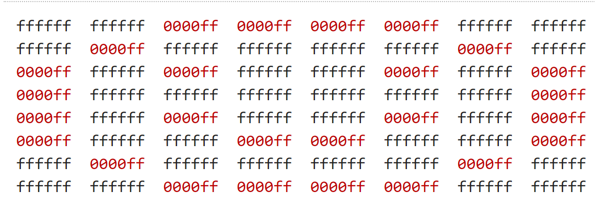

# Whodunit

### Набір файлів для лабораторної роботи

#### Завантаження

```bash
$ wget http://cdn.cs50.net/2018/x/psets/4/whodunit.zip
$ unzip whodunit.zip
$ rm whodunit.zip
$ cd whodunit
$ ls
README.md  bmp.h  clue.bmp  copy.c  large.bmp  small.bmp  smiley.bmp
```

### Вступ

Вітаємо вас у садибі Тюдорів. Людина, що вас приймала - містер Бодді - нажаль, раптово помер - він став жертвою нечесних ігор. Щоб виграти у цю гру, вам потрібно дізнатись, хто це зробив.

На жаль для вас (і навіть на більший жаль для містера Бодді), єдиний доказ, що у вас є - це 24-бітний BMP файл, що називається `clue.bmp` (зображений нижче), який намалював містер Бодді на його комп'ютері у його останні хвилини. Серед червоного "шуму" заховано малюнок, який підскаже нам, хто ж вчинив убивство.


Ще в далекому дитинстві ви викинули [той шматок червоного пластику](https://docs.cs50.net/2018/x/psets/4/whodunit/a6100c96163cd9ec3e6df3621d5db6d5.jpg), який би розв'язав цю таємницю, а отже, замість цього, вам доведеться застосувати уміння комп'ютерного науковця.

Але спочатку - невеличка передумова.

Мабуть найпростіший спосіб представлення зображення - використати двомірну таблицю пікселів (тобто крапок) різних кольорів. Для чорно-білих зображень, нам достатньо мати 1 біт на піксель, так як 0 може представляти чорний колір а 1 - білий, як це показано на зображенні (адаптовано з http://www.brackeen.com/vga/bitmaps.html)


У цьому випадку зображення є лише "картою" бітів (bitmap). Для більш кольорових зображень вам просто необхідно мати більше бітів на піксель. Формати файлів (такі як [GIF](https://en.wikipedia.org/wiki/GIF)), що підтримують "8-бітний колір" використовують 8 біт на піксель. Інші формати файлів ( такі як [BMP](https://en.wikipedia.org/wiki/BMP_file_format), [JPEG](https://en.wikipedia.org/wiki/JPEG) чи [PNG](https://en.wikipedia.org/wiki/Portable_Network_Graphics)), що підтримують "24-бітний колір" використовують 24 біт на піксель. (BMP насправді підтримує 1-, 4-, 8-, 16-, 24- і 32-бітний колір).

24-бітний BMP (який і використав містер Бодді) використовує 8 біт, щоб вказати кількість червоного у кольорі пікселя, 8 біт, щоб вказати кількість зеленого у кольорі пікселя і 8 біт, щоб вказати кількість блакитного у кольорі пікселя. Якщо ви колись чули про RGB колір, це він і є: червоний, зелений і блакитний (red, green, blue).

Якщо значення R, G і B у якомусь пікселі BMP дорівнюють 0xff, 0x00 і 0x00 у шістнадцятковій системі, цей піксель є виключно червоним, так як 0xff (255 у десятковій системі числення) означає "багато червоного", в той час як 0x00 і 0x00 означають відсутність зеленого і блакитного відповідно. З урахуванням того, насільки червоним є BMP містера Бодді, у ньому однозначно є багато пікселів з таким значенням RGB. Але в ньому також є і пікселі з іншими значеннями.

До речі, HTML і CSS (мови програмування, за допомогою яких можна створити веб сторінки) моделюють кольори таким же чином. Якщо вам цікаво, рекомендуємо почитати http://en.wikipedia.org/wiki/Web_colors для подальшої інформації.

Тепер давайте поговоримо більш технічно. Пригадайте, що файл - це всього лиш послідовність бітів, що впорядковані певним чином. 24-бітний BMP файл насправді є послідовністю бітів, в якій (майже) кожні 24 біти представляють колір певного пікселю. Але BMP файл також містить у собі деякі "метадані" - інформацію про висоту і ширину зображення тощо. Ці метадані зберігаються на початку файлу у формі двох структур даних, які зазвичають називають "заголовками" (не плутайте їх із файлами заголовків у С). Ці заголовки змінювались із часом. Ця задача очікує, що ви будете підтримувати лише останню версію формату Microsoft BMP 4.0, яка була представлена у Windows 95. Перший з цих заголовків, що називається `BITMAPFILEHEADER`, має довжину 14 байт. (Пригадайте, 1 байт дорівнює 8 бітам).

Другий із цих заголовків, що називається `BITMAPINFOHEADER`, має довжину 40 байт. Одразу ж після цих заголовків слідує сама "карта" бітів: масив байтів, кожна трійка з яких представляє колір пікселя. (У 1-, 4-, і 16-бітних BMP (але не у 24- і 32-бітних) присутній ще один заголовок, що слудє одразу за `BITMAPINFOHEADER`. Він називається `RGBQUAD` і візначає "значення інтенсивності" для кожного кольору у палітрі пристрою). Однак, BMP зберігає ці трійки задом наперед (тобто у форматі BGR), із 8 бітами для блакитного, 8 бітами для зеленого і 8 бітами для червоного кольорів. (Деякі файли BMP також зберігають саму "карту" бітів задом-наперед, тобто верхній рядок зображення знаходиться в кінці BMP файлу. Але ми зберегли BMP для цієї задачі так, як описано раніше - тобто спочатку у файлі іде опис верхнього рядка пікселів, а в кінці - останнього). Інакше кажучи, якщо б ми сконвертували 1-бітний смайлик, зображений вище, у 24-бітний смайлик, замінивши чорний колір на червоний, ми б зберегали карту бітів так, як показано на малюнку. `0000ff` означає червоний колір, а `ffffff` - білий. Ми виділили червоним всі входження `0000ff`.



Так як ми представили ці біти зліва направо зверху вниз, у 8 стовпчиків, ви дійсно можете побачити червоний смайл, якщо зробите крок назад.

Щоб остаточно все зрозуміти, пригадайте, що шістнадцятеричний розряд представляє 4 біти. А отже, `ffffff` у шістнадцяткові системі дорівнює `111111111111111111111111` у двійковій.

**Зупиніться! Не читайте текст далі до тих пір, поки ви не зрозумієте, чому `0000ff` представляє собою червоний піксель у 24-бітному BMP файлі.**

Що ж, давайте перейдемо від теорії до практики. В середині переглядача файлів CS50 IDE двічі натисніть на файл **smiley.bmp**, і ви повинні побачити невелике обличчя розміром 8 на 8 пікселів. За допомогою випадаючого меню у щойно відкритій вкладці цього файлу, змініть масштаб від **100%** до **800%**, і ви побачите більше зображення, схоже на рисунок нижче. (Якщо зображення виглядає розпливчатим, переконайтесь що опція **Smooth** зверху вікна не обрана). При такому рівні збільшення, ви дійсно можете побачити пікселі зображення (як великі квадрати).


Добре, давайте подивимось на байти, що складають собою `smiley.bmp`. В середині переглядача файлів CS50 IDE, натисніть правою кнопкою миші (чи використайте ctrl+click) на **smiley.bmp** і оберіть **Open as hexadecimal**. Таким чином ви подивитесь на байти файла у шістнадцятковій системі. У вкладці, що відкрилась, змініть значення **Start** на **54**, змініть **Bytes per row** на **24**, змініть **Bytes per column** на **3**. Далі натисніть **Set**. Якщо ви не можете змінити ці значення, спробуйте натиснути **View > Night Mode** і спробуйте ще раз. Ви повинні побачити те, що зображено на рисунку, байти `smiley.bmp` без урахування перших 54-х. (Пригадайте, що у 24-бітному BMP перші 14 + 40 = 54 байти заповнені метаданими, тому зараз ми їх просто ігноруємо). Як і раніше, ми виділили червоним всі входження `0000ff`.


Отже, `smiley.bmp` має ширину і висоту 8 пікселів, і є 24-бітним BMP (кожен його піксель складається з 24 ÷ 8 = 3 байт). Отже, кожен рядок ("скануюча лінія")  займає (8 пікселів) × (3 байти на піксель) = 24 байти, що є дільником числа 4. Виявляється, що BMP файли зберігаються трошки по іншому якщо кількість байт у рядку не ділиться на 4. Прикладом цього може бути файл `small.bmp`, який також є 24-бітним BMP, що представляє собою зелену коробоку з розмірами 3 пікселі у ширину на 3 пікселі у висоту. Якщо ви переглянете його (натиснувши на відповідний файл двічі), він буде схожим на зображення нижче, хоча і буде суттєво меншим. (Дійсно, вам можливо знову доведеться змінити масштаб щоб побачити рисунок.)


Кожен рядок у `small.bmp` займає (3 пікселі) × (3 байти на піксель) = 9 байт, що не є множником 4. І тому рядок доповняють мінімальною кількістю нульових байт, необхідною, щоб загальна кількість байт ділилась на 4. Іншими словами, для кожного рядка у 24-бітному BMP потрібне доповнення розміром від 0 до 3 байт. (Розумієте чому?). У випадку `small.bmp`, необхідно додати 3 байти нулів, тому що (3 пікселі) × (3 байти на піксель) + (3 байти доповнення) = 12 байт, а 12 ділиться на 4.

Для того, щоб побачити ці доповнення, в середині переглядача файлів CS50 IDE, натисніть правою кнопкою миші (чи використайте ctrl+click) на **small.bmp** і оберіть **Open as hexadecimal**.  У вкладці, що відкрилась, змініть значення **Start** на **54**, змініть **Bytes per row** на **12**, змініть **Bytes per column** на **3**. Далі натисніть **Set**. Ви повинні побачити те, що зображено на рисунку; Ми виділили зеленим всі входження `00ff00`.


### Набір файлів для лабораторної роботи

Частиною цієї задачі є набір файлів, які створили працівники CS50. Перед тим, як внести свій вклад, вам потрібно прочитати (і зрозуміти!) ці файли. Існує набір файлів заголовків, що ви вже використовуєте протягом деякого часу (`cs50.h`, `stdio.h` тощо). Ці файли "живуть" всередині IDE CS50. На відміну від них, файли, які ми вам надаємо, будуть "жити" поряд із вашим кодом. Таким чином, вам буде легше їх побачити.

#### Завантаження

Ось як ви можете завантажити ці файли.

Спочатку виконайте наступну команду:

```bash
cd ~/workspace/pset3/
```

Таким чином, ви перейдете до папки `~/workspace/pset3/`. Після цього, виконайте наступну команду:

```bash
wget http://cdn.cs50.net/2017/fall/psets/3/music.zip
```

Таким чином ви завантажете необхідні файли як ZIP архів. Якщо ви зараз виконаєте команду `ls`, ви маєте побачити файл `music.zip` всередині вашої папки `pset3`. Для того, щоб розархівувати ці файли, виконайте наступну команду: 

```bash
unzip music.zip`
```

а після цього - команду

```bash
rm music.zip
```

Таким чином ви розархівуєте всі необхідні файли та видалите файл архіву. Якщо ви виконаєте команду `ls`, ви повинні побачити папку з назвою `music` всередині папки `pset3`. Виконайте команду:

```bash
cd music/
```

Таким чином ви перейдете у цю папку. Виконайте команду `ls`. Ви повинні побачити файли і папку, що наведені нижче. Вони і є тим набором файлів, які вам необхідні!

```bash
Makefile  helpers.c  helpers.h  notes.c  synthesize.c  songs/  wav.c  wav.h
```

#### Розуміння наданих файлів

Давайте прочитаємо ці файли для того, щоб зрозуміти їх. У майбутньому, читання (і розуміння!) коду інших людей, коду сторонніх бібліотек, часто буде вашим першим кроком у розв'язанні задачі. Таким чином, ви можете спиратися на роботу інших програмістів, і, завдяки цьому, розв'язувати навіть більш цікаві задачі!

#### `songs/`

Для початку, відкрийте папку `songs/`, за допомогою команди `cd` чи за допомогою переглядача файлів CS50 IDE. У цій папці знаходяться декілька файлів `.txt`, всередині кожного з яких, як виявляється, знаходиться пісня! Так як ASCII не придатний для того, щоб відобразити партитуру, працівники CS50 переробили представлення пісень таким чином, щоб комп'ютер їх міг розуміти. У кожній лінії файлу знаходиться опис ноти і її тривалості, розділені символом `@`. Наприклад, згори файлу `jeopardy.txt` (який ми вам пропонуємо відкрити), знаходяться наступні рядки:

```
G4@1/4
C5@1/4
G4@1/4
C4@1/4
G4@1/4
C5@1/4
G4@1/4
```

Перша нота вступної пісні Jeopardy має тривалість 1/4 і є нотою G четвертої октави (Jeopardy - інтелектуальна гра на американському телебаченні; аналог на російському телебаченні - "Своя гра" - примітка перекладача). Друга нота має таку ж тривалість, але є нотою C п'ятої октави (тобто знаходиться на декілька клавіш правіше на фортепіано). Після неї йдуть ще п'ять нот з такою тривалістю. 

Під цими сімома рядками у jeopardy.txt знаходяться два пустих рядки. Це означає, що після сьомої ноти слідують дві паузи довжиною 1/8 (що еквівалентно одній паузі довжини 1/4).  Після цих пауз, знову починає грати музика (із ще однією паузою через декілька нот).

Зрозуміло? Перегляньте ще декілька інших `.txt` файлів у папці `songs`. Хоча рядки цих файлів на перший погляд виглядають наче шифр, вони на справді є всього лиш перекладом красивішої партитури у формат, що може зрозуміти комп'ютер. Коли ми говоримо про формат, що може зрозуміти комп'ютер, ми маємо на увазі, що скоро ви напишете код, який зчитує ці ноти і їх тривалості!

#### `notes.c`

Далі відкрийте файл `notes.c`. У цьому файлі знаходиться програма (яку ми називатимемо `notes`), яка не тільки друкує на екран частоти (у Гц) всіх нот в октаві, але й створює WAV файл (аудіо файл), за допомогою якого ви можете почути ці ноти. За замовчуванням, програма працює із четвертою октавою, але якщо ви передасте їй аргумент командного рядка (ціле число від 0 до 8 включно), ви зможете побачити і почути частоти нот будь якої октави.

Прочитайте код і коментарі у файлі `notes.c` і постарайтесь зрозуміти більшість (а може і всі), рядки коду. Деякі з них можуть виглядати незнайомо. Наприклад, за конвенцією (мається на увазі, що така практика є загальноприйнятою серед програмістів), цей код використовує функцію `fprintf` для того, щоб вивести повідомлення про помилку до `stderr` (standard error) замість `printf`, який, як виявляється, виводить свої повідомлення до `stdout` (standard output). За замовчуванням і повідомлення, які виводяться до `stdout`, і повідомлення, які виводяться до `stderr`, з'являються на екрані користувача. Але їх можна розділити під час виконання програми, і це дасть змогу користувачу відрізняти повідомлення про помилку від решти повідомлень. Трошки більше про це ми розкажемо у майбутніх роботах.

Також зверніть увагу, що функція `main` повертає `1` у випадку помилки. Це також робиться відповідно до конвенції. До цього часу ми не повертали ніяких значень із `main`. Але пригадайте, що весь цей час main мав тип даних, яикй він має повернути, а саме `int`. Виявляється, що коли `main` закінчує своє виконання, він за замовчуванням повертає `0`, що, за конвенцією, означає успіх. Якщо ж щось йде не так, за конвенцією слід повернути значення, відмінне від `0` (наприклад `1`). Це значення називають "кодом виходу", і воно може бути використано щоб розрізняти один тип помилки від іншого. Насправді, якщо ви колись бачили загадковий код помилки на екрані вашого комп'ютера, це цілком могло бути значення, яке повернула функція main програми, що ви використовували в той момент.

Також зверніть увагу, що ця програма використовує функцію `sprintf`, яка, замість того, щоб друкувати на екран, зберігає свої вихідні дані у рядку (звідси і `s` у `sprintf` - string printf). Ми використовуємо її щоб створити рядок із двох підстановок, `%s` та `%i`. Зверніть увагу на те, як ми виділяємо місце для (короткого) рядка шляхом визначення масива на 4 символи. Далі ми використовємо `sprintf` щоб зберегти `NOTES[i]` (рядок, звідси і `%s`) та `octave` (ціле число, звідси і `%i`) у цій виділеній пам'яті. Таким чином ми можемо взяти значення як, наприклад `"A"` та `4` і, фактично, об'єднати їх (тобто дописати другу частину до першої) для того, щоб створити новий рядок (наприклад, `"A4"`).

Також у цій програм ми викликаємо (можливо) незнайомі нам функції `song_open`, `frequency`, `note_write` і `song_close`. Виявляється, що ці функції реалізовані у інших файлах, що ми вам надали. Слідкуйте за ними!

#### `synthesize.c`

У цьому файлі знаходиться програма (яку ми називатимемо `synthesize`), що синтезує (тобто генерує) пісню із послідовності нот. Зверніть увагу на те, як вона отримує ноти від користувача одну за одною, використовуючи `get_string`. Cпочатку вона перевіряє, чи не є вхідні дані користувача паузою, що трапилось би у випадку, якби користувач просто натиснув Enter. Інакше ж вона розбиває вхідні дані на дві частини: ноту, яку можна знайти зліва від `@`, та дріб (що позначає тривалість ноти), який можна знайти справа від `@`. Для цього використовується функція `strtok`. Після цього програма записує ноту (чи паузу) до файлу.

#### `wav.h`

Далі відкрийте файл `wav.h`, файл заголовків, який використовують `notes.c` та `synthesize.c`. Цей файл, разом із `wav.c` представляє собою не програму, а бібліотеку - набір функцій, які можуть використовувати інші програми у якості будівельних блоків. Так само, `cs50` та `stdio` є бібліотеками. Відмінність полягає у тому, що код цієї бібліотеки живе у вашому робочому просторі.

У файлі `wav.h` присутні визначення двох нових типів даних: один називається `note`, а інший - `song`. Але більше про це (і про ключові слова на зразок `typedef` і `struct`) ми поговоримо пізніше. Зараз лише зверніть увагу, як цей файл визначає 4 функції (`note_write`, `rest_write`, `song_close`, and `song_open`), які використовують `notes` та `synthesize`.

#### `wav.c`

В той же час у `wav.c` знаходяться справжні реалізації цих функцій та декількох інших. Дійсно, цей файл містить у собі функції, що реалізують підтримку WAV файлів, популярного формату аудіо файлів. Ці функції дозволяють `notes` та `synthesize` зберігати ноти на диск у файлах із розширенням `.wav`. Для того, щоб послухати ці файли, просто відкрийте їх у переглядачі файлів CS50 IDE. Або ж ви можете завантажити їх на ваш комп'ютер та послухати їх локально.

Немає потреби розуміти весь код у `wav.c`, але ми запрошуємо вас прочитати цей код якщо у вас є таке бажання!

#### `Makefile`

Далі відкрийте `Makefile`, формат якого, скоріше за все, відрізняється від усього що ви бачили до цього. Як і натякає назва цього файлу, він є спорідненим до `make`, програми, яку ви,мабуть, використовували щоб скомпілювати більшість ваших програм, так як компілювання із `clang` зазвичай вимагає більшої кількості натискань на клавіші. У попередніх задачах нам не був потрібен `Makefile`, який, насправді, є конфігураційним файлом для `make`, так як `make` міг зрозуміти, як компілювати програму, що складається з одного файла (наприклад, `hello.c`). Але компіляція `notes` та `synthesize` вимагає компіляції декількох файлів, адже обидві ці програми покладаються на `wav.h` та `wav.c`, а також на два інших файли, `helpers.h` і `helpers.c`.

Просте виконання

```bash
make notes
```

чи

```bash
make synthesize
```

не надало б `make` достатньо інформації щоб зрозуміти, які файли йому потрібні. `Makefile` існує, щоб `make` знав, як скомпілювати ці програми.

#### `helpers.h`

У цьому файлі присутні визначення трьох функцій:

- `duration`, яка приймає у якості вхідних даних дріб у вигляді рядка (наприклад, `1/4`) і повертає `int`, що відповідає кількості 1/8-их у цьому дробові (у нашому випадку `2`, так як `1/4` = `2/8`)

- `frequency`, яка приймає у якості вхідних даних рядок відформатований як
  - `XY` (наприклад, `A4`), де `Х` - будь-яка буква від `A до G`, а `Y` - будь-яка цифра від `0` до `8` чи
  - `XYZ` (наприклад, `A#4`), де `Х` - будь-яка буква від `A` до `G`, `Y` - `#` або `b`, і `Z` - будь-яка цифра від `0` до `8`,

  і повертає ціле число, частоту ноти, округлену до найближчого цілого.

- `is_rest`, що повертає `true`, якщо його вхідні дані (рядок) представляють собою паузу у описаному вище представленні; інакше функція має повернути `false`.

#### `helpers.c`

У цьому файлі мають бути реалізації цих трьох функцій, але ні! Поки що ні. Саме ви маєте їх реалізувати!

### Специфікація

#### `bday.txt`

У файлі `bday.txt` наберіть ASCII представлення пісні *Happy Birthday*, переклавши її партитуру, що надана вище, до вигляду, з яким може працювати комп'ютер (також описаний вище). Ваша пісня повинна розпочинатись з:

```
D4@1/8
D4@1/8
E4@1/4
D4@1/4
G4@1/4
F#4@1/2
```

#### `helpers.c`

#### `is_rest`

Завершіть реалізацію `is_rest` у `helpers.c`. Пригадайте, що паузи позначаються пустими рядками у нашому форматі. І пригадайте, що `synthesize` викликає цю функцію для того, щоб визначити, чи рядок, який ввів користувач дійсно є позначає паузу.

Як визначити, чи рядок пустий? Для того, щоб відповісти на це запитання, спочатку подивіться на код `cs50.h`, де задокументована функція `get_string`.

https://github.com/cs50/libcs50/blob/develop/src/cs50.h

Що говорять коментарі згори від `get_string` про те, що повертає функція якщо користувач просто натискає Enter, таким чином вводячи лише символ переведення рядка (тобто `\n`)?

Коли такий рядок передається до `is_rest`, як ця функція (ні, ви!) маєте це розпізнати?

#### `duration`

Завершіть реалізацію `duration` у `helpers.c`. Пригадайте, що функція має приймати у якості вхідних даних рядок, що представляє собою дріб, і конвертувати його у цілу кількість 1/8-их. Ви можете припустити, що цей рядок буде відформатовано у вигляді `X/Y`, де `X` і `Y` - додатні десяткові цифри, а `Y`, до того ж, є степеню числа 2.

#### `frequency`

Нарешті, завершіть реалізацію `frequency` у `helpers.c`. Пригадайте, що ця функція має приймати у якості вхідних даних рядок, що позначає ноту (наприклад `A4`) і повертати відповідну їй частоту у герцах як ціле число.

Також пригадайте:

1. Частота, `f`, деякої ноти складє 2<sup>n/12</sup> × 440, де `n` - кількість напівтонів між цією нотою і `A4`.

2. Кожна клавіша на фортепіано знаходиться на відстані одного напівтону (чи напівкроку) від сусідньої клавіші, не важливо - білої чи чорної.

3. Ефект `#` і `b`, також відомих як альтераційні знаки, полягає у підвищенні чи пониженні, відповідно, висоти ноти на один напівтон.

Під час реалізації цієї функції вам можуть знадобитись функції `pow` і `round`, визначені у `math.h`.

### Відеоінструкція

[Посилання на YouTube](https://www.youtube.com/watch?list=PLhQjrBD2T380boRF-5b7Dow2opWBbZhLH&v=PwrtaYvm1K0)

### Тестування

Для того, щоб скомпілювати `notes` та `synthesize`, виконайте

```bash
make
```

Це скомпілює обидва файли при умові, що у `helpers.c` відсутні синтаксичні помилки.

Для того, щоб перевірити вашу реалізацію `frequency` у `helpers.c`, виконайте `notes`, яка викликає як раз цю функцію, наступним чином:

```bash
./notes
```

Переконайтесь, що виведені частоти відповідають вашим підрахункам (на папері чи калькуляторі). Ви також можете послухати файл `notes.wav`, і, якщо у вас є музичний слух, перевірити результат таким чином. Перевірте інші октави, вказавши їх номер як аргумент командного рядка:

```bash
./notes 5
```

Для того, щоб краще протестувати `frequency` разом із `is_rest` та `duration`, виконайте `synthesize`

```bash
./synthesize test.wav
```

Далі введіть одну або декілька нот, по одній ноті в рядок. Коли ви закінчете вводити ноти, натисніть `ctrl-d`, щоб надіслати сигнал `EOF` ("end of file" - кінець файлу) до `get_string`, щоб він вийшов із циклу у програмі. Відкрийте результуючий файл (тобто `test.wav`) виконавши

```bash
open test.wav
```

чи двічі натиснувши на `test.wav` у переглядачі файлів CS50 IDE. Послухайте пісню щоб побачити (ну добре, почути), чи вона звучить, як, на вашу думку, вона повинна звучати!

**Не забудьте обирати різне ім'я для кожного WAV-файлу, що ви синтезуєте. Інакше ваш браузер може закешувати (запам'ятати) і зіграти стару версію заново згенерованого WAV файлу.**

Набирання нот швидко може стати нудним. Тому ви замість цього можете скористатись "перенаправленням вхідних даних" для того, щоб передавати цілі файли як вхідні дані для `synthesize`. Наприклад, щоб передати усі ноти файла `jeopardy.txt` до `synthesize`, виконайте команду:

```bash
./synthesize jeopardy.wav < songs/jeopardy.txt
```

Потім виконайте

```bash
open jeopardy.wav
```

чи просто двічі натисніть на `jeopardy.wav` у переглядачі файлів CS50 IDE. Таким чином ви відкриєте і послухаєте (при умові, що у вас немає помилок!) згенеровану пісню.

#### Коректність

```bash
check50 cs50/2018/x/music
```

#### Стиль

```bash
style50 helpers.c
```

### Підказки

Як завжди, коли ви пишете код, робіть маленькі кроки, імплементуючи мінімальну кількість рядків, після якої ви можете перевірити свій прогрес і виправити можливі помилки. Тільки коли цей крок виконано (тобто помилок немає!) ви повинні приступати до наступного. Ви можете планувати ваші кроки написавши пвсевдокод до того, як почнете писати код.

У контексті `frequency`, ваші кроки можуть бути такими:

1. Спочатку реалізуйте підтримку тільки для нот `A0`, `A1` ... `A8`. Переконайтесь, що частоти, які повертає `frequency`, співпадають з реальними значеннями. Ви це можете зробити, виконавши `notes`, або використовуючи `debug50` чи `eprintf`. Порівняйте вихідні дані вашої функції із вашими підрахунками на папері чи калькуляторі.

2. Далі додайте підтримку для `#` і `b`, але знову ж таки для вищезазначених нот (тобто для `A#0`, `A#1` ... `A#8` і `Ab0`, `Ab1` ... `Ab8`)

3. Далі додайте підтримку для нот `B`. Далі - для нот `C`. Далі - для решти нот.

