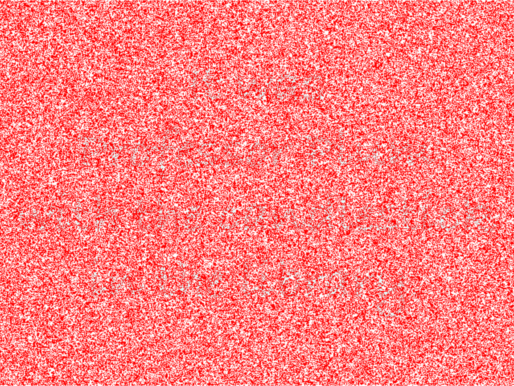

# Whodunit

### Набір файлів для лабораторної роботи

#### Завантаження

```bash
$ wget http://cdn.cs50.net/2018/x/psets/4/whodunit.zip
$ unzip whodunit.zip
$ rm whodunit.zip
$ cd whodunit
$ ls
README.md  bmp.h  clue.bmp  copy.c  large.bmp  small.bmp  smiley.bmp
```

### Вступ

Вітаємо вас у садибі Тюдорів. Людина, що вас приймала - містер Бодді - нажаль, раптово помер - він став жертвою нечесних ігор. Щоб виграти у цю гру, вам потрібно дізнатись, хто це зробив.

На жаль для вас (і навіть на більший жаль для містера Бодді), єдиний доказ, що у вас є - це 24-бітний BMP файл, що називається `clue.bmp` (зображений нижче), який намалював містер Бодді на його комп'ютері у його останні хвилини. Серед червоного "шуму" заховано малюнок, який підскаже нам, хто ж вчинив убивство.



Ще в далекому дитинстві ви викинули [той шматок червоного пластику](https://docs.cs50.net/2018/x/psets/4/whodunit/a6100c96163cd9ec3e6df3621d5db6d5.jpg), який би розв'язав цю таємницю, а отже, замість цього, вам доведеться застосувати уміння комп'ютерного науковця.

Але спочатку - невеличка передумова.

Мабуть найпростіший спосіб представлення зображення - використати двомірну таблицю пікселів (тобто крапок) різних кольорів. Для чорно-білих зображень, нам достатньо мати 1 біт на піксель, так як 0 може представляти чорний колір а 1 - білий, як це показано на зображенні (адаптовано з http://www.brackeen.com/vga/bitmaps.html)


У цьому випадку зображення є лише "картою" бітів (bitmap). Для більш кольорових зображень вам просто необхідно мати більше бітів на піксель. Формати файлів (такі як [GIF](https://en.wikipedia.org/wiki/GIF)), що підтримують "8-бітний колір" використовують 8 біт на піксель. Інші формати файлів ( такі як [BMP](https://en.wikipedia.org/wiki/BMP_file_format), [JPEG](https://en.wikipedia.org/wiki/JPEG) чи [PNG](https://en.wikipedia.org/wiki/Portable_Network_Graphics)), що підтримують "24-бітний колір" використовують 24 біт на піксель. (BMP насправді підтримує 1-, 4-, 8-, 16-, 24- і 32-бітний колір).

24-бітний BMP (який і використав містер Бодді) використовує 8 біт, щоб вказати кількість червоного у кольорі пікселя, 8 біт, щоб вказати кількість зеленого у кольорі пікселя і 8 біт, щоб вказати кількість блакитного у кольорі пікселя. Якщо ви колись чули про RGB колір, це він і є: червоний, зелений і блакитний (red, green, blue).

Якщо значення R, G і B у якомусь пікселі BMP дорівнюють 0xff, 0x00 і 0x00 у шістнадцятковій системі, цей піксель є виключно червоним, так як 0xff (255 у десятковій системі числення) означає "багато червоного", в той час як 0x00 і 0x00 означають відсутність зеленого і блакитного відповідно. З урахуванням того, насільки червоним є BMP містера Бодді, у ньому однозначно є багато пікселів з таким значенням RGB. Але в ньому також є і пікселі з іншими значеннями.

До речі, HTML і CSS (мови програмування, за допомогою яких можна створити веб сторінки) моделюють кольори таким же чином. Якщо вам цікаво, рекомендуємо почитати http://en.wikipedia.org/wiki/Web_colors для подальшої інформації.

Тепер давайте поговоримо більш технічно. Пригадайте, що файл - це всього лиш послідовність бітів, що впорядковані певним чином. 24-бітний BMP файл насправді є послідовністю бітів, в якій (майже) кожні 24 біти представляють колір певного пікселю. Але BMP файл також містить у собі деякі "метадані" - інформацію про висоту і ширину зображення тощо. Ці метадані зберігаються на початку файлу у формі двох структур даних, які зазвичають називають "заголовками" (не плутайте їх із файлами заголовків у С). Ці заголовки змінювались із часом. Ця задача очікує, що ви будете підтримувати лише останню версію формату Microsoft BMP 4.0, яка була представлена у Windows 95. Перший з цих заголовків, що називається `BITMAPFILEHEADER`, має довжину 14 байт. (Пригадайте, 1 байт дорівнює 8 бітам). Другий із цих заголовків, що називається `BITMAPINFOHEADER`, має довжину 40 байт. Одразу ж після цих заголовків слідує сама "карта" бітів: масив байтів, кожна трійка з яких представляє колір пікселя. (У 1-, 4-, і 16-бітних BMP (але не у 24- і 32-бітних) присутній ще один заголовок, що слідує одразу за `BITMAPINFOHEADER`. Він називається `RGBQUAD` і визначає "значення інтенсивності" для кожного кольору у палітрі пристрою). Однак, BMP зберігає ці трійки задом наперед (тобто у форматі BGR), із 8 бітами для блакитного, 8 бітами для зеленого і 8 бітами для червоного кольорів. (Деякі файли BMP також зберігають саму "карту" бітів задом-наперед, тобто верхній рядок зображення знаходиться в кінці BMP файлу. Але ми зберегли BMP для цієї задачі так, як описано раніше - тобто спочатку у файлі іде опис верхнього рядка пікселів, а в кінці - останнього). Інакше кажучи, якщо б ми сконвертували 1-бітний смайлик, зображений вище, у 24-бітний смайлик, замінивши чорний колір на червоний, ми б зберегали карту бітів так, як показано на малюнку. `0000ff` означає червоний колір, а `ffffff` - білий. Ми виділили червоним всі входження `0000ff`.


Так як ми представили ці біти зліва направо зверху вниз, у 8 стовпчиків, ви дійсно можете побачити червоний смайл, якщо зробите крок назад.

Щоб остаточно все зрозуміти, пригадайте, що шістнадцятеричний розряд представляє 4 біти. А отже, `ffffff` у шістнадцяткові системі дорівнює `111111111111111111111111` у двійковій.

**Зупиніться! Не читайте текст далі до тих пір, поки ви не зрозумієте, чому `0000ff` представляє собою червоний піксель у 24-бітному BMP файлі.**

Що ж, давайте перейдемо від теорії до практики. В середині переглядача файлів CS50 IDE двічі натисніть на файл **smiley.bmp**, і ви повинні побачити невелике обличчя розміром 8 на 8 пікселів. За допомогою випадаючого меню у щойно відкритій вкладці цього файлу, змініть масштаб від **100%** до **800%**, і ви побачите більше зображення, схоже на рисунок нижче. (Якщо зображення виглядає розпливчатим, переконайтесь що опція **Smooth** зверху вікна не обрана). При такому рівні збільшення, ви дійсно можете побачити пікселі зображення (як великі квадрати).


Добре, давайте подивимось на байти, що складають собою `smiley.bmp`. В середині переглядача файлів CS50 IDE, натисніть правою кнопкою миші (чи використайте ctrl+click) на **smiley.bmp** і оберіть **Open as hexadecimal**. Таким чином ви подивитесь на байти файла у шістнадцятковій системі. У вкладці, що відкрилась, змініть значення **Start** на **54**, змініть **Bytes per row** на **24**, змініть **Bytes per column** на **3**. Далі натисніть **Set**. Якщо ви не можете змінити ці значення, спробуйте натиснути **View > Night Mode** і спробуйте ще раз. Ви повинні побачити те, що зображено на рисунку, байти `smiley.bmp` без урахування перших 54-х. (Пригадайте, що у 24-бітному BMP перші 14 + 40 = 54 байти заповнені метаданими, тому зараз ми їх просто ігноруємо). Як і раніше, ми виділили червоним всі входження `0000ff`.


Отже, `smiley.bmp` має ширину і висоту 8 пікселів, і є 24-бітним BMP (кожен його піксель складається з 24 ÷ 8 = 3 байт). Отже, кожен рядок ("скануюча лінія")  займає (8 пікселів) × (3 байти на піксель) = 24 байти, що є дільником числа 4. Виявляється, що BMP файли зберігаються трошки по іншому якщо кількість байт у рядку не ділиться на 4. Прикладом цього може бути файл `small.bmp`, який також є 24-бітним BMP, що представляє собою зелену коробоку з розмірами 3 пікселі у ширину на 3 пікселі у висоту. Якщо ви переглянете його (натиснувши на відповідний файл двічі), він буде схожим на зображення нижче, хоча і буде суттєво меншим. (Дійсно, вам можливо знову доведеться змінити масштаб щоб побачити рисунок.)


Кожен рядок у `small.bmp` займає (3 пікселі) × (3 байти на піксель) = 9 байт, що не є множником 4. І тому рядок доповняють мінімальною кількістю нульових байт, необхідною, щоб загальна кількість байт ділилась на 4. Іншими словами, для кожного рядка у 24-бітному BMP потрібне доповнення розміром від 0 до 3 байт. (Розумієте чому?). У випадку `small.bmp`, необхідно додати 3 байти нулів, тому що (3 пікселі) × (3 байти на піксель) + (3 байти доповнення) = 12 байт, а 12 ділиться на 4.

Для того, щоб побачити ці доповнення, в середині переглядача файлів CS50 IDE, натисніть правою кнопкою миші (чи використайте ctrl+click) на **small.bmp** і оберіть **Open as hexadecimal**.  У вкладці, що відкрилась, змініть значення **Start** на **54**, змініть **Bytes per row** на **12**, змініть **Bytes per column** на **3**. Далі натисніть **Set**. Ви повинні побачити те, що зображено на рисунку; ми виділили зеленим всі входження `00ff00`.


Для контрасту, давайте поглянемо на файл `large.bmp`, який виглядає ідентично до small.bmp, але є в 4 рази більшим (має розміри 12 на 12 пікселів). Натисніть на цей файл у переглядачі файлів CS50 IDE правою кнопкою миші (чи використайте ctrl+click) і оберіть **Open as hexadecimal**. Ви повинні побачити те, що зображено на рисунку; ми знову виділили зеленим всі входження `00ff00`.


Зверніть увагу на те, що в BMP немає доповнень! Зрештою, (12 пікселів) × (3 байти на піксель) = 36 байт, які дійсно кратні 4.

Усі ці знання знадобляться вам!

Добре, CS50 IDE тільки показала вам байти в цих BMP файлах. Як ми насправді отримуватимемо їх програмним способом? У `copy.c` зебережена програма, чия єдина мета в житті є створення копії BMP. Звичайно, ви могли би просто використовувати `cp` для цього. Але `cp` не збирається допомогти містеру Бодді. Будемо сподіватися, що `copy.c` це зробить!

Скомпілюйте `copy.c` у програму, що називається `copy`, використовуючи `make`. (Пам'ятаєте як?) Після цього виконайте наступну команду:

```bash
./copy smiley.bmp copy.bmp
```

Якщо ви потім виконаєте `ls` (з відповідним прапорцем), ви повинні побачити, що `smiley.bmp` і `copy.bmp` дійсно мають однаковий розмір. Давайте ще раз перевіримо чи вони насправді однакові! Виконайте наступну команду:

```bash
diff smiley.bmp copy.bmp
```

Якщо ця команда нічого не вивела вам, то файли дійсно є ідентичними. (Зверніть увагу, що деякі програми, такі як Photoshop, додають хвостові нулі на кінцях деяких ВМР. Наша версія `copy` викидує такі нулі, так що не дуже турбуйтесь, якщо ви намагаєтеся скопіювати BMP, який ви завантажили або створили, і побачили, що копія, насправді, на кілька байт менше, ніж оригінал.) Ви можете відкрити обидва файли в програмі перегляду зображень (за допомогою подвійного кліку), щоб підтвердити це візуально. Але diff робить це порівняння байт у байт, тому його зір, мабуть, гостріший, ніж у вас!

Так як же була створена ця копія? Виявляється, що `copy.c` використоує `bmp.h`. Давайте подивимося. Відкрийте `bmp.h` і ви побачите фактичні визначення цих заголовків, які ми вже згадували, адаптовані з власних реалізацій від Microsoft. Крім того, цей файл визначає типи даних `BYTE`, `DWORD`, `LONG`, і `WORD` які, як правило, зустрічаються у світі Win32 (тобто Windows) програмування. Зверніть увагу на те, що вони є просто псевдонімами для примітивів, з якими ви (я сподіваюся) вже знайомі. Виявляється, що `BITMAPFILEHEADER` і `BITMAPINFOHEADER` використовують ці типи. Цей файл також визначає структуру `struct`, яка називається `RGBTRIPLE`, що, попросту кажучи, "інкапсулює" три байти: один синій, один зелений і один червоний (нагадаємо, що це і є порядок кольороів, в якому ми шукатимемо RGB-трійки на диску).

Чим корисні ці структури? Що ж, нагадаємо, що файл є просто послідовністю байтів (або, в кінцевому рахунку, бітів) на диску. Але ці байти, як правило, впорядковані таким чином, що перші кілька з них представляють собою щось, наступні кілька представляють щось ще, і так далі. "Формати файлів" існують тільки тому, що світ стандартизував, які байти що означають. Ми могли би просто прочитати файл з диска в оперативну пам'ять як один великий масив байтів. І ми могли б просто пам'ятати, що байт на позиції `[i]` являє собою одну річ, в той час як байт на позиції `[j]` представляє щось інше. Але чому би не дати деяким з цих байтів імена, так, щоб ми могли б легше діставати їх з пам'яті? Це саме те, що дозволяють нам робити структури в `bmp.h`. Замість того, щоб думати про якийсь файл, як одну довгу послідовність байтів, ми можемо замість того думати про нього як про послідовність структур.

Нагадаємо, що `smiley.bmp` має розмір 8 на 8 пікселів, і тому він повинен займати 14 + 40 + (8 × 8) × 3 = 246 байт на диску. (Підтвердити це можна за допомогою команди `ls`). Ось як це виглядає на диску відповідно до Microsoft:


Як видно з цього малюнка, порядок має значення, коли справа доходить до полів структури. Байт 57 представляє собою `rgbtBlue` (а не, скажімо, `rgbtRed`), тому що `rgbtBlue` визначений в `RGBTRIPLE` спочатку. Використання нами атрибуту (*`attribute`*), що називається *`packed`*, гарантує нам те, що clang не спробує "вирівнювати по слову" поля структури (при цьому адреса першого байту кожного поля є кратною 4), адже це призведе до того, що ми отримаємо "прогалини" в наших структурах, які фактично не існують на диску. Але нам можна не хвилюватись про це прямо зараз.

На останок, ви могли помітити, що у `copy.c` у випадках, коли ми виводимо повідомлення про помилку, ми використовуємо `fprintf` (першим аргументом у якого є `stderr`), а не більш знайомий нам `printf`. Виявляється, що `printf` друкує повідомлення до "standard output" (`stdout`), пунктом призначення якого зазвичай є вікно терміналу користувача. Але також існує і "standard error" (`stderr`), пунктом призначення якого зазвичай (що, мабуть, трохи заплутує) також є вікно терміналу користувача. Але, використовуючи `stdout` і `stderr`, програміст може розділяти повідомлення про помилку від решти повідомлень, і якщо він хоче, будь який з цих потоків може бути перенаправлено (за допомогою `>` чи `|`) кудись в інше місце, а не у вікно терміналу користувача.

Інакше кажучи,

```C
printf("hello, world\n");
```

є еквівалентом

```C
fprintf(stdout, "hello, world\n");
```

але перший запис є більш лаконічним.  Для того ж, щоб вивести повідомлення про помилку до `stderr`, використовуйте `fprintf`, як показано нижче.

```C
fprintf(stderr, "Usage: ./whodunit infile outfile\n");
```

### Запитання

Знайдіть URL, які відповідають `BITMAPFILEHEADER` і `BITMAPINFOHEADER`, відповідно до коментарів в `bmp.h`. Замість того, щоб змушувати вас безцільно дивитись на `copy.c`, ми поставимо вам кілька питань, і нехай ви навчите себе, як в ньому працює код. 

Відкрийте файл `README.md` і замініть там кожен запис `TODO` (окрім останнього) вашими відповідями на відповідні запитання. Цей файл написано за допомогою Markdown - формату для текстових файлів, що дозволяє легко стилізувати текст. Наприклад, ми помістили на початку кожного запитання `##` для того, щоб коли цей файл переглядався на GitHub, запитання були написані більшим і жирним шрифтом. Ми також оточили ключові слова, що стосуються коду символом `\` - в такому випадку на GitHub їх шрифт буде схожим на шрифт кода. 

Немає потреби писати ваші відповіді на Markdown; достатньо і звичайного тексту. Але якщо ви хочите якимось чином відформатувати ваші відповіді, прочитайте https://guides.github.com/features/mastering-markdown/ для консультації.

### Специфікація

Напишіть програму, що називається `whodunit`, яка розкриває малюнок містера Бодді, щоб ви могли дізнатись, хто ж вчинив злочин.

- Реалізуйте вашу програму у файлі `whodunit.c` у папці `whodunit`.

- Ваша програма повинна приймати рівно два аргументи командного рядка: ім'я вхідного файлу, з якого буде зчитано зображення, і ім'я вихідного файлу, в який буде виведено зображення.

- Якщо ваша програма виконується із меншою чи більшою кількістю аргументів командного рядка, ніж 2, вона повинна нагадати користувачеві, як її правильно використовувати за допомогою `fprintf`, що виводить повідомлення до `stderr`. `main` у цьому випадку має повернути `1`.

- Якщо ваша програма не може відкрити вхідний файл, вона повинна повідомити користувача про це за допомогою `fprintf`, що виводить повідомлення до `stderr`. `main` у цьому випадку має повернути `2`.

- Якщо ваша програма не може відкрити вихідний файл, вона повинна повідомити користувача про це за допомогою `fprintf`, що виводить повідомлення до `stderr`. `main` у цьому випадку має повернути `3`.

- Якщо вхідний файл не є не стиснутим 24-бітним файлом BMP 4.0, ваша програма повинна повідомити користувача про це за допомогою `fprintf`, що виводить повідомлення до `stderr`. `main` у цьому випадку має повернути `4`.

- У випадку успішного виконання, `main` повинен повернути `0`.

### Запитання - продовження

Що ж, хто ж вчинив злочин? Замініть останнє `TODO` у `README.md` вашою відповідю!

### Відеоінструкція

[Посилання на YouTube](https://www.youtube.com/watch?v=Igsa7V5ouzg)

### Використання вашої програми

Ваша програма повинна поводитись, як вказано у прикладах.

```bash
$ ./whodunit
Usage: ./whodunit infile outfile
$ echo $?
1
```

```bash
$ ./whodunit clue.bmp verdict.bmp
$ echo $?
0
```

### Підказки

Що ж, згадайте як ви в дитинстві тримали цей шматок червоної пластмаси поверх аналогічних прихованих повідомлень. (Якщо ви не пам’ятаєте такого шматка пластику, краще буде запитати однокурсника про його або її дитинство). По суті, пластик перетворив все в червоне, але якось показав ці повідомлення. Реалізуйте цю саму ідею в `whodunit`. Як і `copy`, ваша програма повинна приймати саме два аргументи командного рядка, і якщо ви виконаєте вашу програму як показано нижче, то результат збережеться у `verdict.bmp`, який буде файлом  BMP, у якому малюнок містера Бодді буде не покритий шумом.

```bash
./whodunit clue.bmp verdict.bmp
```

Дозвольте нам припустити, що ви почнете розв'язувати цю таємницю, виконавши команду нижче.

```bash
cp copy.c whodunit.c
```

Після цього додайте і/або змініть лише декілька рядків коду.

У `smiley.bmp` немає нічого прихованого, але не соромтесь перевірити програму на цих пікселях, адже це зображення є малим і ви можете порівняти вивід вашої програми із шістнадцятковим виводом CS50 IDE.

Будьте впевнені в тому, що існує більше ніж одне рішення. Як тільки малюнок містера Бодді є ідентифікованим (вами), незалежно від його розбірливості, містер Бодді буде спочивати у спокою.

### Тестування

Оскільки whodunit може бути реалізованим декількома способами, ви не зможете перевірити правильність реалізацій з check50!

### Розв'язок працівників CS50

У цей раз рішення працівників відсутнє, і тому ніщо не зіпсує вашого задоволення від розв'язування цієї задачі!